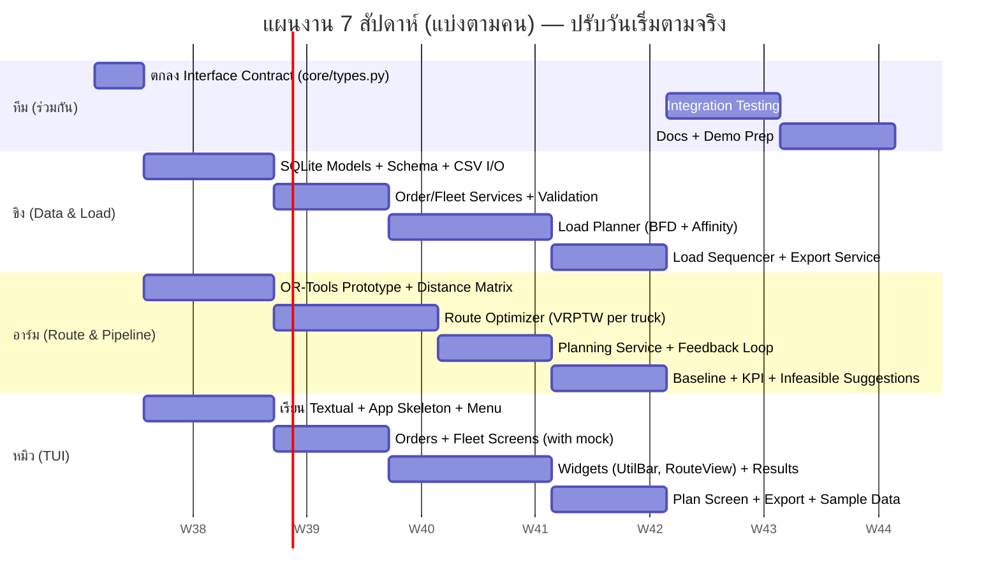

# 👥 แผนแบ่งงานทีม (Work Breakdown Structure) v2.0
## ทีม 3 คน: ขิง, อาร์ม, หมิว — ปรับตาม SRS 2.0 (TUI Edition)

---

## 0. สรุปสิ่งที่เปลี่ยนจากแผนเดิม

| | แผนเดิม (v1.1) | แผนใหม่ (v2.0) |
|---|---|---|
| **ขิง** | Backend & Database (PostgreSQL, FastAPI, Auth) | **Data & Load Engineer** — SQLite, Services, CSV I/O, **Algorithm 1: Load Planner** |
| **อาร์ม** | Optimization Engine (VRPTW อย่างเดียว) | **Route & Pipeline Engineer** — **Algorithm 2: Route Optimizer**, Distance Matrix, Feedback Loop, KPI |
| **หมิว** | Frontend Web (HTML/Leaflet/Chart.js) | **TUI Developer** — Textual App ทุกหน้าจอ + Widgets + Demo |
| **จุดเชื่อมงาน** | REST API Contract (JSON) | **Python Interface Contract** (dataclasses ใน `core/types.py`) |
| **งานที่หายไป** | — | REST API, Authentication, Leaflet Map, Chart.js, Responsive CSS, PostgreSQL setup |
| **งานที่เพิ่มมา** | — | Load Planner (Bin Packing), Load Sequencer (LIFO), Feedback Loop, Utilization Bar, Route Sheet/Load Sheet |

> 💡 เหตุผลที่ย้าย Load Planner ให้ขิง: งาน Backend หายไปเยอะ (ไม่มี API/Auth/Postgres) ในขณะที่อัลกอริทึมเพิ่มจาก 1 → 2 ตัว ถ้าให้อาร์มทำทั้งสองตัวจะหนักเกินไป และ Load Planner ผูกกับ Data Model (น้ำหนัก/ปริมาตร/ข้อจำกัดรถ) โดยตรง จึงเหมาะกับคนที่ออกแบบ Schema

---

## 1. หลักการแบ่งงาน

แบ่งตาม **3 Layer ของ Architecture (SRS Section 5.1)** โดยแต่ละคนเป็นเจ้าของโฟลเดอร์ของตัวเองชัดเจน ลด merge conflict:

| บทบาท | ผู้รับผิดชอบ | โฟลเดอร์ที่เป็นเจ้าของ | โฟกัสหลัก |
|--------|-------------|------------------------|-----------|
| 🗄️📦 **Data & Load Engineer** | **ขิง** | `db/`, `utils/`, `services/order_*`, `services/fleet_*`, `services/export_*`, `engine/load_planner.py`, `engine/load_sequencer.py` | ข้อมูล + "ของขึ้นรถคันไหน ลำดับไหน" |
| 🧮🛣️ **Route & Pipeline Engineer** | **อาร์ม** | `engine/distance.py`, `engine/route_optimizer.py`, `engine/baseline.py`, `services/planning_service.py` | "แต่ละคันวิ่งทางไหน" + ต่อท่อ Load ↔ Route |
| 🖥️ **TUI Developer** | **หมิว** | `tui/` ทั้งหมด, `sample_data/`, `main.py` | หน้าจอ Terminal ทุกหน้า + Demo |

> ⚠️ ทุกคนต้องเข้าใจ **`core/types.py` (Interface Contract)** ร่วมกัน — เป็นจุดเชื่อมแทน API Contract เดิม (ดู Section 4)

---

## 2. รายละเอียดงานแต่ละคน (Mapped to SRS 2.0)

### 🗄️📦 ขิง — Data & Load Engineer

| SRS Reference | งานที่รับผิดชอบ | Output |
|---------------|-----------------|--------|
| Section 6 / Data Model | ออกแบบ SQLAlchemy Models (Customer, Order, Vehicle, Depot, Plan, PlanRoute, PlanStop) + `schema.sql` | `db/models.py`, `db/database.py` |
| FR1 | CSV Import + Parse (รองรับทั้ง `volume_m3` และ `L×W×H×qty`) | `utils/csv_io.py` |
| FR1.2 | Validation (null, GPS ผิดช่วง, weight ≤ 0, time_end < time_start) คืน error list ต่อแถวให้ TUI ไป highlight | `utils/validation.py` |
| FR2, FR3 | OrderService: CRUD, search/filter, ยอดรวม weight/volume/จุดส่ง | `services/order_service.py` |
| FR4, FR5 | FleetService: CRUD รถ, Depot config, สถานะรถ | `services/fleet_service.py` |
| **FR6** (Algorithm 1) | **Load Planner** — Best-Fit Decreasing ตาม $$\max(w_i/W,\ v_i/V)$$ + Geographic Affinity + Vehicle Restriction + Target Utilization + Unassigned report | `engine/load_planner.py` |
| FR6.8 | Manual Override + Re-validate ความจุ | function ใน LoadPlanner |
| **FR7** | **Load Sequencer (LIFO)** + แบ่งโซน ก้นรถ/กลาง/ท้ายรถ + flag ห้ามทับ | `engine/load_sequencer.py` |
| FR14 | ExportService: JSON / CSV / Route Sheet .txt / Load Sheet .txt | `services/export_service.py` |
| Section 10 | Unit Test: validation, csv_io, load_planner (case ของล้น / ไม่ล้น / restriction) | `tests/test_load_planner.py`, `tests/test_validation.py` |

**Deliverables:**
```
✅ db/models.py, db/database.py, db/schema.sql
✅ utils/csv_io.py, utils/validation.py
✅ services/order_service.py, fleet_service.py, export_service.py
✅ engine/load_planner.py          ← อัลกอริทึมตัวที่ 1
✅ engine/load_sequencer.py
✅ tests/test_load_planner.py, tests/test_validation.py
```

> 💡 **Optional (ถ้ามีเวลา Week 5+):** CP-SAT Bin Packing สำหรับออเดอร์ ≤ 60 ใบ เพื่อปรับปรุงผลจาก Heuristic — ปรึกษาอาร์มได้เพราะใช้ OR-Tools เหมือนกัน

---

### 🧮🛣️ อาร์ม — Route & Pipeline Engineer

| SRS Reference | งานที่รับผิดชอบ | Output |
|---------------|-----------------|--------|
| FR8.7 | Distance / Time Matrix: Haversine (default, offline) + OSRM client (optional) + cache | `engine/distance.py` |
| **FR8** (Algorithm 2) | **Route Optimizer** — OR-Tools VRPTW ต่อคัน (ตรึง assignment จาก Load Planner), Time Window, Service Time $$s_i = s_0 + \alpha w_i$$, Depot window, GLS, Timeout | `engine/route_optimizer.py` |
| FR8 | Drop-penalty node เพื่อระบุออเดอร์ที่ทำให้ infeasible | logic ใน RouteOptimizer |
| **FR9** | **Feedback Loop** Load → Route → (conflict) → Re-pack สูงสุด N รอบ | `services/planning_service.py` |
| FR10 | Infeasible Handling + Suggestion ("เพิ่มรถ X คัน ~Y kg / Z m³", "ขยาย TW ออเดอร์ #..") + Partial mode | logic ใน PlanningService |
| FR13 | Baseline (First-Fit ตาม order_id) + KPI: จำนวนรถ, ระยะทาง, Avg Utilization, On-time %, ต้นทุนประมาณ | `engine/baseline.py`, `engine/kpi.py` |
| NFR Performance | Progress callback ให้ TUI แสดง (รันใน background thread) | callback interface ใน PlanningService |
| Section 10 | Performance Test (100 orders / 10 trucks ≤ 30s), Test feedback loop | `tests/test_route_optimizer.py`, `tests/test_pipeline.py` |

**Deliverables:**
```
✅ engine/distance.py
✅ engine/route_optimizer.py       ← อัลกอริทึมตัวที่ 2
✅ engine/baseline.py, engine/kpi.py
✅ services/planning_service.py    ← ตัวต่อท่อทั้ง pipeline (SRS 5.2)
✅ tests/test_route_optimizer.py, tests/test_pipeline.py
```

> ⚠️ **อาร์มเป็นเจ้าของ `planning_service.py`** เพราะเป็นคนที่เห็นทั้ง Load (จากขิง) และ Route (ของตัวเอง) — ต้องคุยกับขิงเรื่อง interface ของ `LoadPlanner.plan()` และ `LoadPlanner.repack()` ตั้งแต่ Week 1

---

### 🖥️ หมิว — TUI Developer

| SRS Reference | งานที่รับผิดชอบ | Output |
|---------------|-----------------|--------|
| FR11 | Textual App: เมนูหลัก, Navigation, Keyboard shortcuts, Status Bar, Help (`?`) | `tui/app.py` |
| FR1.3, FR1.4, FR2, FR3 | Orders Screen: ตาราง, ค้นหา/filter, ฟอร์มกรอกมือ, Import CSV + Preview highlight แถว error | `tui/screens/orders.py`, `tui/widgets/forms.py` |
| FR4, FR5 | Fleet Screen: ตารางรถ, ฟอร์มรถ, ตั้งค่า Depot, เปลี่ยนสถานะ | `tui/screens/fleet.py` |
| FR6–FR10 (UI) | Plan Screen: เลือกออเดอร์/รถ, ตั้ง Timeout/Target Utilization, Progress Bar, แสดง Infeasible + Suggestions | `tui/screens/plan.py` |
| **FR12** | Results Screen: Summary Panel, ตารางต่อคัน, Route Detail, Tab Load Sheet, Manual Override (ย้ายออเดอร์ข้ามรถ) | `tui/screens/results.py` |
| FR7.4, FR12.3 | **Utilization Bar Widget** `[████████░░] 82%` | `tui/widgets/utilization_bar.py` |
| FR12.6 | **Route View Widget** `DEPOT ──▶ C3 ──▶ C7 ──▶ DEPOT` | `tui/widgets/route_view.py` |
| FR13 | Before/After KPI Panel | ใน Results Screen |
| FR14 (UI) | Export Screen: เลือก format + path | `tui/screens/export.py` |
| NFR Compatibility | ทดสอบบน Windows Terminal / PowerShell / Linux, UTF-8, 100×30 | Test checklist |
| — | Sample Data (orders 50–100 ใบ, รถ 5–10 คัน, มี case ยากๆ) สำหรับ Demo | `sample_data/*.csv` |
| — | User Guide (วิธีใช้งาน TUI + คีย์ลัด) | `docs/USER_GUIDE.md` |

**Deliverables:**
```
✅ main.py, tui/app.py
✅ tui/screens/orders.py, fleet.py, plan.py, results.py, export.py
✅ tui/widgets/utilization_bar.py, route_view.py, forms.py
✅ sample_data/orders_sample.csv, vehicles_sample.csv
✅ docs/USER_GUIDE.md
```

> 💡 **หมิวต้องเริ่มด้วย Mock Data** — สร้าง `tests/fixtures/mock_plan_result.py` (PlanResult ปลอม) ตั้งแต่ Week 2 เพื่อทำหน้า Results ได้โดยไม่ต้องรอ engine เสร็จ

---

## 3. Timeline พร้อมเจ้าของงาน



### สรุปตามสัปดาห์

| Week | ขิง 🗄️📦 | อาร์ม 🧮🛣️ | หมิว 🖥️ |
|------|----------|-----------|---------|
| **1** | **ทั้งทีม:** เขียน `core/types.py` ร่วมกัน (3 วันแรก) → ขิง: SQLAlchemy Models + SQLite init | → อาร์ม: ศึกษา OR-Tools Routing, Prototype TSPTW 5 จุด | → หมิว: ศึกษา Textual, App skeleton + เมนูหลัก + Status Bar |
| **2** | CSV Import/Parse + Validation (คืน error ต่อแถว) | Distance Matrix (Haversine + cache), โครง OSRM client | Orders Screen + Fleet Screen (ใช้ mock service ก่อน) |
| **3** | OrderService + FleetService (ต่อ DB จริง) → **ส่งให้หมิวเชื่อม** | Route Optimizer: Time Window + Service Time + Depot window | ฟอร์มกรอกมือ + Import Preview highlight error + ต่อ Service จริงของขิง |
| **4** | **Load Planner** BFD + Vehicle Restriction + Unassigned report | Route Optimizer: GLS + Timeout + Drop-penalty (หา infeasible orders) | Utilization Bar + Route View widgets + Results Screen (ใช้ `mock_plan_result`) |
| **5** | Load Planner: Geographic Affinity + Target Utilization + Manual Override/Re-validate → **ส่ง interface ให้อาร์ม** | **Planning Service + Feedback Loop** (เรียก LoadPlanner ของขิงจริง) + Progress callback | Plan Screen (Progress Bar, Infeasible + Suggestions) + Load Sheet Tab |
| **6** | Load Sequencer (LIFO) + Export (JSON/CSV/Route Sheet/Load Sheet) | Baseline + KPI + Suggestion messages + Performance test 100 orders | Export Screen + Manual Override UI + Sample Data ชุด Demo |
| **7** | **Integration Testing ทั้งทีม** — รัน pipeline จริงผ่าน TUI end-to-end, ทดสอบบน Windows/Linux, แก้ Bug, เขียน Docs, เตรียม Presentation | | |

> 🔑 **จุดเสี่ยง 2 จุด:**
> 1. **Week 5** — อาร์มต้องเรียก LoadPlanner ของขิงจริง ถ้า interface ไม่ตรงกับที่ตกลงไว้จะเสียเวลา → ยึด `core/types.py` เป็นหลัก ห้ามเปลี่ยนโดยไม่บอกทีม
> 2. **Week 7** — Integration แน่นมาก ควรเริ่ม smoke test ตั้งแต่ปลาย Week 6 (ให้หมิวลองกด Plan ด้วย engine จริงแม้ยังไม่ครบ)

---

## 4. จุดเชื่อมงาน (Interface Contract) — แทน API Contract เดิม

เนื่องจากไม่มี REST API แล้ว จุดเชื่อมทั้งหมดคือ **Python dataclasses** ในไฟล์เดียว `core/types.py` ที่ **ทั้ง 3 คนเขียนร่วมกันใน 3 วันแรก** และเปลี่ยนได้เฉพาะเมื่อทีมตกลงกัน

```python
# core/types.py — ตัวอย่างโครงที่ต้องตกลงกันใน Week 1
from dataclasses import dataclass, field

@dataclass
class OrderInput:
    order_id: int
    customer_name: str
    lat: float
    lon: float
    weight_kg: float
    volume_m3: float
    tw_start: int              # นาทีตั้งแต่ 00:00 เช่น 540 = 09:00
    tw_end: int
    stackable: bool = True
    allowed_vehicle_types: set[str] | None = None   # None = ทุกประเภท

@dataclass
class VehicleInput:
    vehicle_id: int
    license_plate: str
    vehicle_type: str          # "4W" | "6W" | "10W"
    max_weight_kg: float
    max_volume_m3: float
    fixed_cost: float
    cost_per_km: float

@dataclass
class LoadAssignment:          # Output ของขิง (Algorithm 1) → Input ของอาร์ม
    assignment: dict[int, list[int]]     # vehicle_id -> [order_id]
    unassigned: list[int]
    utilization: dict[int, tuple[float, float]]   # vehicle_id -> (weight%, volume%)

@dataclass
class Stop:
    seq: int
    order_id: int
    arrival_min: int
    wait_min: int
    service_min: int
    dist_from_prev_km: float

@dataclass
class TruckRoute:              # Output ของอาร์ม (Algorithm 2)
    vehicle_id: int
    stops: list[Stop]
    total_km: float
    depart_min: int
    return_min: int
    warnings: list[str] = field(default_factory=list)

@dataclass
class LoadSheetItem:           # Output ของขิง (Load Sequencer)
    load_seq: int
    order_id: int
    zone: str                  # "REAR" | "MIDDLE" | "FRONT"
    no_stack_on_top: bool

@dataclass
class PlanResult:              # สิ่งที่หมิวเอาไปแสดงทั้งหมด
    routes: list[TruckRoute]
    load_sheets: dict[int, list[LoadSheetItem]]
    unassigned: list[int]
    suggestions: list[str]
    kpi_before: dict
    kpi_after: dict
    iterations: int
```

| จุดเชื่อม | ใครคุยกับใคร | ต้องตกลงอะไร |
|-----------|-------------|--------------|
| `OrderInput` / `VehicleInput` | ขิง ↔ อาร์ม ↔ หมิว | หน่วย (kg, m³, นาที), ค่า default, ชื่อ vehicle_type |
| `LoadAssignment` | **ขิง ↔ อาร์ม** | signature ของ `LoadPlanner.plan(orders, vehicles, distance_matrix)` และ `repack(assignment, conflict_order_ids)` |
| `TruckRoute` → Load Sequencer | อาร์ม ↔ ขิง | อาร์มส่ง route เสร็จ → ขิง reverse เป็น load sequence |
| `PlanResult` + Progress callback | **อาร์ม ↔ หมิว** | หมิวต้องรู้ทุก field ที่จะแสดง + `on_progress(stage: str, pct: float)` |
| Service methods | ขิง ↔ หมิว | `OrderService.list(filter)`, `import_csv(path) -> (rows, errors)`, `FleetService.set_depot(...)` |
| CSV Columns | ขิง ↔ หมิว | ชื่อคอลัมน์ใน `sample_data/` ต้องตรงกับที่ `csv_io.py` parse |

**Mock ที่ต้องมีใน Week 2:**
- `tests/fixtures/mock_plan_result.py` — PlanResult ปลอม 3 คัน 12 ออเดอร์ (หมิวใช้ทำ Results Screen)
- `tests/fixtures/mock_load_assignment.py` — LoadAssignment ปลอม (อาร์มใช้ทำ Route Optimizer ก่อน Load Planner เสร็จ)

---

## 5. Git Workflow

```
main (release)
  │
  ├── dev (integration)
  │     │
  │     ├── feature/core-types            (ทั้งทีม, Week 1 เท่านั้น)
  │     ├── feature/data-layer            (ขิง)
  │     ├── feature/load-planner          (ขิง)
  │     ├── feature/export                (ขิง)
  │     ├── feature/distance-matrix       (อาร์ม)
  │     ├── feature/route-optimizer       (อาร์ม)
  │     ├── feature/planning-pipeline     (อาร์ม)
  │     ├── feature/tui-skeleton          (หมิว)
  │     ├── feature/tui-orders-fleet      (หมิว)
  │     └── feature/tui-results           (หมิว)
```

**กติกา:**
- ✅ แก้ `core/types.py` ต้องเปิด PR แยกและให้อีก 2 คน approve
- ✅ Merge เข้า `dev` ทุกสัปดาห์ ก่อน Weekly Sync
- ✅ ก่อน Merge รัน `pytest` ผ่านทั้งหมด (อย่างน้อย test ของตัวเอง)
- ✅ Weekly Sync ทุกศุกร์ 30 นาที: demo สิ่งที่ทำได้ + บอกสิ่งที่ติด + เช็ค interface ยังตรงกันไหม
- ✅ ใช้ `requirements.txt` ร่วมกัน (textual, ortools, sqlalchemy, pytest) — ใครเพิ่ม lib ต้องบอกทีม

---

## 6. งานที่ทำร่วมกันทั้งทีม

| งาน | สัดส่วน / ผู้นำ |
|-----|----------------|
| **`core/types.py` (Week 1)** | ทุกคน 33/33/33 — อาร์มเป็นคน lead เพราะเป็นเจ้าของ pipeline |
| **Integration Testing (Week 7)** | ทุกคน — หมิว lead (เป็นคนกดใช้งานจริง), ขิง/อาร์ม แก้ engine |
| **SRS / Documentation** | ขิง: Data Model + Load Planner (Section 6.1, 6.3) · อาร์ม: Route Optimizer + Pipeline (Section 5.2, 6.2) · หมิว: TUI + User Guide (Section 3.5) |
| **Sample / Demo Data** | หมิว สร้าง · อาร์ม ตรวจว่ามี case ยาก (TW ชน, ของเกิน 1 คัน, restriction) · ขิง ตรวจว่า parse ผ่าน |
| **Presentation** | ขิง: ปัญหา + ความต่าง Parcel vs Truck + Load Planning · อาร์ม: Routing + Feedback Loop + KPI ผลลัพธ์ · หมิว: Live Demo TUI |
| **Bug Fixing สุดท้าย** | ตาม owner ของโฟลเดอร์ที่ bug อยู่ |

---