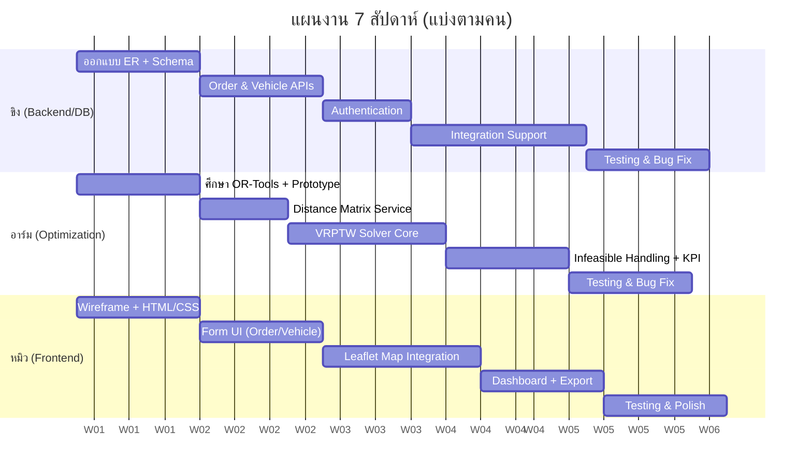

#  แผนแบ่งงานทีม (Work Breakdown Structure)
## ทีม 3 คน: ขิง, อาร์ม, หมิว

---

## 1. หลักการแบ่งงาน

แบ่งตาม **3 แกนหลัก** ของระบบ เพื่อให้แต่ละคนมีความรับผิดชอบชัดเจน ประเมินผลงานได้ง่าย และลด conflict ตอน merge code:

| บทบาท | ผู้รับผิดชอบ | โฟกัสหลัก |
|--------|-------------|-----------|
| 🗄️ **Backend & Database Engineer** | **ขิง** | Database, API (CRUD), Authentication |
| 🧮 **Optimization Engine Developer** | **อาร์ม** | OR-Tools, Distance Matrix, Algorithm |
| 🎨 **Frontend & Visualization Developer** | **หมิว** | UI, Map, Dashboard, UX |

> 💡 แม้แบ่งเป็น 3 สายหลัก แต่ทุกคนต้อง**เข้าใจภาพรวมของ API Contract** (Section 7) ร่วมกัน เพราะเป็นจุดเชื่อมงานทั้ง 3 ฝั่ง

---

## 2. รายละเอียดงานแต่ละคน (Mapped to SRS)

### 🗄️ ขิง — Backend & Database Engineer

| SRS Reference | งานที่รับผิดชอบ | Output |
|---------------|-----------------|--------|
| Section 6 (Data Model) | ออกแบบ ER Diagram + เขียน `schema.sql` | Database พร้อมใช้งาน |
| FR1, FR2, FR3 | Order Management APIs (Upload CSV, Manual Entry, List, Delete) | `api/orders.py` |
| FR4, FR5 | Fleet Management APIs (CRUD รถ, Depot, Status) | `api/vehicles.py` |
| Section 4 (Security) | Basic Authentication (Login/Session) | Login system |
| Section 7.1 | API Endpoints ตาม Spec | Swagger Docs (auto-gen จาก FastAPI) |
| Section 6 | `database.py` (SQLAlchemy connection + ORM Models) | Models.py |
| Section 10 | Unit Test สำหรับ Data Validation | `test_validation.py` |

**Deliverables:**
```
✅ backend/database.py
✅ backend/models.py
✅ backend/api/orders.py
✅ backend/api/vehicles.py
✅ database/schema.sql
✅ Authentication module
```

---

### 🧮 อาร์ม — Optimization Engine Developer

| SRS Reference | งานที่รับผิดชอบ | Output |
|---------------|-----------------|--------|
| FR6, FR7 | Core VRPTW Solver ด้วย OR-Tools | `services/optimizer.py` |
| FR7.4 | Distance Matrix (เชื่อม OSRM หรือคำนวณ Haversine) | `services/distance_service.py` |
| FR7.5 | Guided Local Search Penalty Function | Logic ใน optimizer |
| FR8 | Infeasible Case Handling + Suggestion Logic | Error handling |
| Section 7.2 | `api/optimization.py` (Endpoint `/optimize`) | API พร้อม Response format |
| FR12 | คำนวณ KPI (Distance Reduction %, Vehicle Used) | `services/metrics.py` |
| Section 10 | Performance Testing (วัดเวลาที่ solver ใช้) | Test report |

**Deliverables:**
```
✅ backend/services/optimizer.py  (ตัวสำคัญที่สุดของโปรเจกต์)
✅ backend/services/distance_service.py
✅ backend/services/metrics.py
✅ backend/api/optimization.py
✅ ไฟล์ทดสอบ Solomon Benchmark (ถ้ามีเวลา)
```

> ⚠️ **นี่คืองานหัวใจของโปรเจกต์** — อาร์มควรเริ่มศึกษา OR-Tools ตั้งแต่ Week 1 ควบคู่ไปกับที่ขิงทำ Database เพราะเป็นส่วนที่ยากและใช้เวลามากที่สุด

---

### 🎨 หมิว — Frontend & Visualization Developer

| SRS Reference | งานที่รับผิดชอบ | Output |
|---------------|-----------------|--------|
| Section 8 (Frontend) | โครงหน้าเว็บ HTML/CSS | `index.html`, `style.css` |
| FR1.4, FR2 | ฟอร์ม Upload CSV + Manual Order Entry (UI) | `main.js` |
| FR9, FR10 | Leaflet.js Map + Route Visualization | `map.js` |
| FR11 | Route List Table + Export Button (JSON/CSV) | UI Component |
| FR12 | KPI Dashboard ด้วย Chart.js | `dashboard.js` |
| Section 4 (Usability) | Responsive Design (Desktop/Tablet/Mobile) | CSS Media Queries |
| — | `api.js` (เชื่อม Fetch API ไปยัง Backend) | Integration Layer |

**Deliverables:**
```
✅ frontend/index.html
✅ frontend/css/style.css, map.css
✅ frontend/js/main.js
✅ frontend/js/map.js
✅ frontend/js/api.js
✅ frontend/js/dashboard.js (Chart.js)
```

---

## 3. Timeline พร้อมเจ้าของงาน (Gantt-style)



### สรุปตามสัปดาห์

| Week | ขิง 🗄️ | อาร์ม 🧮 | หมิว 🎨 |
|------|--------|----------|---------|
| **1** | ออกแบบ ER Diagram, Setup PostgreSQL | ศึกษา OR-Tools, ทำ Prototype ง่ายๆ (5 จุด) | Wireframe หน้าเว็บ (Figma/วาดมือ), Setup HTML skeleton |
| **2** | เขียน `schema.sql`, Setup FastAPI project | ทำ Distance Matrix (Haversine ก่อน, ค่อยเปลี่ยนเป็น OSRM) | ทำหน้า Layout หลัก + CSS |
| **3** | Order APIs (Upload CSV, CRUD) | เริ่มเขียน VRPTW Solver (Time Window constraint) | ฟอร์ม Upload/Manual Entry + เชื่อม Fetch API เบื้องต้น |
| **4** | Vehicle APIs + Authentication | ใส่ Capacity Constraint + GLS Penalty | Leaflet Map Setup (แสดง Marker พื้นฐาน) |
| **5** | ช่วย Integration, แก้ Bug API | Infeasible Handling + คำนวณ KPI Metrics | วาดเส้นทางบน Map (Polyline หลายสี) + Popup |
| **6** | **Integration Testing ทั้งทีม** (รวมทุกส่วนเข้าด้วยกัน) | | |
| **7** | เขียน Documentation | เตรียม Benchmark/Demo Data | ทำ Dashboard (Chart.js) + Export CSV/JSON, Polish UI |

> 🔑 **สัปดาห์ 6 คือจุดเสี่ยงที่สุด** — ควรเผื่อเวลา Integration ให้มากกว่าที่คิด เพราะเป็นจุดที่ 3 ฝั่งงานต้องมาเจอกันจริงๆ

---

## 4. จุดเชื่อมงาน (Integration Points) ที่ต้องคุยกันล่วงหน้า

> ⚠️ นี่คือสิ่งที่ทีมต้อง**ตกลงกันตั้งแต่ Week 1** ก่อนแยกไปทำงานใครงานมัน

| จุดเชื่อม | ใครคุยกับใคร | ต้องตกลงอะไร |
|-----------|-------------|--------------|
| **API Contract** | ขิง ↔ หมิว | Field names, JSON structure ต้องตรงกัน (ใช้ Section 7 เป็น baseline) |
| **Optimize Request/Response** | อาร์ม ↔ หมิว | Format ของ `waypoints`, `routes` ที่ map.js จะเอาไปวาด |
| **Order/Vehicle Data Format** | ขิง ↔ อาร์ม | อาร์มต้องรู้ว่า Order/Vehicle จาก DB หน้าตาเป็นยังไงก่อนส่งเข้า Solver |
| **CSV Format** | ขิง ↔ หมิว | Column names ต้องตรงกับที่ backend parse (ใช้ Appendix เป็น baseline) |

**คำแนะนำ:** ให้ **Mock ข้อมูลปลอมไว้ก่อน** (fake JSON) แล้วแชร์กันในทีมตั้งแต่ Week 1-2 เพื่อให้ทั้ง 3 คนพัฒนาแบบขนานกันได้โดยไม่ต้องรอกัน

```json
// mock_response.json (ตัวอย่างที่ควรตกลงกันไว้ก่อน)
{
  "status": "success",
  "routes": [
    {
      "route_id": "R001",
      "vehicle_id": 1,
      "orders": [1, 5, 12],
      "waypoints": [
        {"lat": 13.7563, "lon": 100.5018},
        {"lat": 13.7641, "lon": 100.5120}
      ]
    }
  ]
}
```

---

## 5. Git Workflow แนะนำ

```
main (production-ready)
  │
  ├── dev (integration branch)
  │     │
  │     ├── feature/backend-orders      (ขิง)
  │     ├── feature/backend-vehicles    (ขิง)
  │     ├── feature/optimizer-core      (อาร์ม)
  │     ├── feature/optimizer-kpi       (อาร์ม)
  │     ├── feature/frontend-map        (หมิว)
  │     └── feature/frontend-dashboard  (หมิว)
```

**กติกา:**
- ✅ ทุกคน push เข้า branch ตัวเองก่อน
- ✅ Merge เข้า `dev` ทุกสัปดาห์ (ไม่ปล่อยไว้นานจน conflict บาน)
- ✅ ก่อน Merge ต้อง test ว่า endpoint ตัวเองยังทำงานได้
- ✅ ตั้ง Weekly Sync Meeting (เช่น ทุกวันศุกร์ 30 นาที) เพื่อเช็คว่าใครติดอะไร

---

## 6. งานที่ต้อง "ทำร่วมกันทั้งทีม" (Shared Responsibility)

| งาน | สัดส่วนความรับผิดชอบ |
|-----|----------------------|
| **Integration Testing (Week 6)** | ทุกคน 33/33/33 |
| **SRS/Documentation** | ขิง เขียนส่วน Backend, อาร์ม เขียนส่วน Algorithm, หมิว เขียนส่วน UI |
| **Presentation Slide** | แบ่งคนละหัวข้อ ตามความรับผิดชอบของตัวเอง |
| **Demo Data Preparation** | อาร์ม (เตรียม test case) + หมิว (ตกแต่งให้ดูดีตอน demo) |
| **Bug Fixing สุดท้าย** | ทุกคนช่วยกันตามความถนัด |

---
