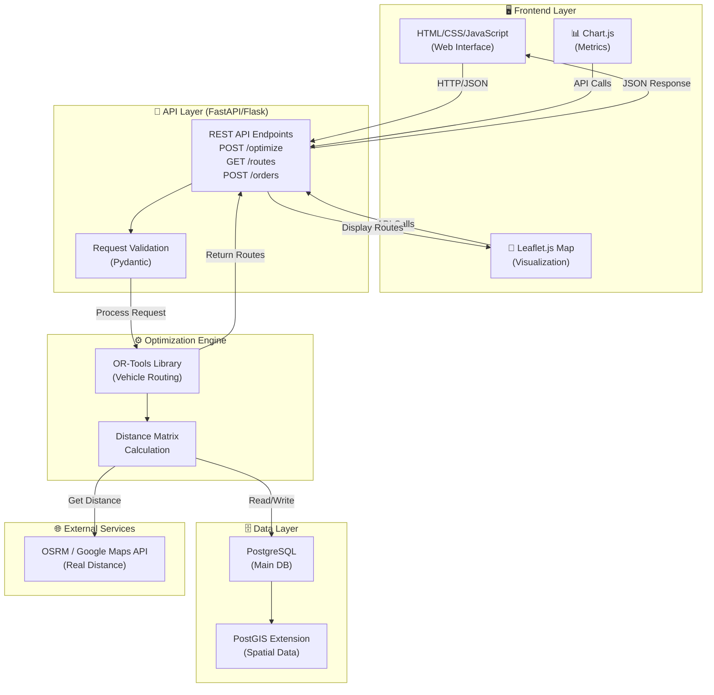
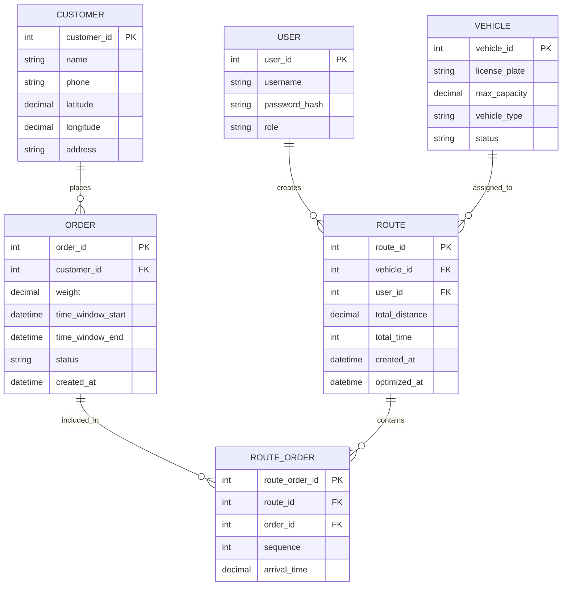

# 📋 Software Requirements Specification 1.0
## Route Optimization System for Logistics Management

---

## 1. Executive Summary

**ชื่อโปรเจกต์:** Route Optimization Engine (ROE)  
**วัตถุประสงค์:** ระบบเว็บแอปพลิเคชันที่ช่วยบริษัทขนส่งจัดเส้นทางการส่งสินค้าแบบอัตโนมัติโดยใช้อัลกอริทึม Vehicle Routing Problem with Time Windows (VRPTW) เพื่อลดต้นทุนและเพิ่มประสิทธิภาพในการส่งสินค้า

**ปัญหาที่แก้:** 
- ปัจจุบันการจัดรถส่งสินค้าทำด้วยมนุษย์ (Manual FCFS) ทำให้รถวิ่งข้ามไปข้ามมา สิ้นเปลืองน้ำมัน
- ระยะทางไม่คุ้ม ใช้รถจำนวนมาก อัตราการส่งทันเวลาต่ำ

**โซลูชัน:**
- Web Application ที่รับข้อมูลออเดอร์และข้อมูลลูกค้า
- Backend Optimization Engine ที่ใช้อัลกอริทึม VRPTW คำนวณเส้นทางที่ประหยัดที่สุด
- Visualization ในรูปแบบแผนที่แสดงเส้นทางแต่ละรถ

---

## 2. Scope (ขอบเขตของระบบ)

### ✅ สิ่งที่ระบบนี้ทำได้ (In Scope)

| ฟีเจอร์ | รายละเอียด |
|--------|-----------|
| **📥 Input Order Data** | รับข้อมูลออเดอร์จากผู้ใช้ผ่าน UI (form) หรือ upload CSV |
| **🗺️ Customer Location** | จัดเก็บตำแหน่ง GPS ของลูกค้า (latitude, longitude) |
| **⏰ Time Window** | ระบุช่วงเวลา (เช่น 09:00-12:00) ที่ลูกค้ารับสินค้า |
| **📦 Package Weight** | ข้อมูลน้ำหนักสินค้าแต่ละออเดอร์ |
| **🚗 Fleet Management** | จัดการข้อมูลรถ (เลขทะเบียน, ความจุ, สถานะ) |
| **🧮 Route Optimization** | คำนวณเส้นทางที่ดีที่สุดโดยใช้ OR-Tools |
| **📊 Route Visualization** | แสดงเส้นทางบนแผนที่ (Leaflet.js) แยกสีตามรถแต่ละคัน |
| **💾 Export Results** | ส่งออกผลลัพธ์เป็น JSON / CSV |
| **📱 Responsive Design** | ใช้งานได้ทั้งบนเดสก์ทอป แท็บเล็ต และมือถือ |


---

## 3. Functional Requirements (ความต้องการเชิงฟังก์ชัน)

### 3.1 Module: Order Management (จัดการออเดอร์)

```
FR1: Upload & Input Orders
├── FR1.1: ระบบรับไฟล์ CSV จากผู้ใช้ (เช่น order_list.csv)
├── FR1.2: Parse ข้อมูล: Order ID, Customer Name, Address, 
│         Latitude, Longitude, Weight, Time Window, Phone
├── FR1.3: Validate ข้อมูล (ตรวจสอบค่า null, invalid GPS)
└── FR1.4: แสดง Preview ของข้อมูลที่ upload ก่อนยืนยัน

FR2: Manual Order Entry
├── FR2.1: ฟอร์มกรอกข้อมูลออเดอร์ใบเดียว
├── FR2.2: Select Customer จาก Dropdown หรือสร้างใหม่
├── FR2.3: Input Time Window (เลือก Start Time & End Time)
└── FR2.4: Input Weight และ Special Notes

FR3: View Order List
├── FR3.1: แสดง Table ของทุกออเดอร์ที่ยังไม่ได้จัด
├── FR3.2: ค้นหา Filter ด้วย Customer Name, Order ID
└── FR3.3: ลบออเดอร์ที่เลือก (Delete)
```

### 3.2 Module: Fleet Management (จัดการคลังรถ)

```
FR4: Vehicle Management
├── FR4.1: สร้าง/แก้ไข/ลบข้อมูลรถ
├── FR4.2: Input: License Plate, Max Capacity (kg), Vehicle Type
├── FR4.3: ตั้ง Depot (คลังสินค้า) - ตำแหน่ง GPS เริ่มต้น
└── FR4.4: แสดง List รถที่ว่างพร้อมใช้

FR5: Fleet Status
├── FR5.1: แสดงสถานะรถแต่ละคัน (Available, In Route, Maintenance)
└── FR5.2: Update สถานะ Manual
```

### 3.3 Module: Route Optimization (คำนวณเส้นทาง)

```
FR6: Run Optimization
├── FR6.1: ผู้ใช้กด Button "Optimize Routes"
├── FR6.2: ระบบส่ง Request ไปยัง Backend พร้อมข้อมูล Order & Vehicle
├── FR6.3: Backend ใช้ OR-Tools คำนวณเส้นทางที่ดีที่สุด
├── FR6.4: Set Timeout = 30 วินาที (ถ้านานกว่านี้ให้คืน Best Solution ที่หา)
└── FR6.5: Return ผลลัพธ์ (Routes) กลับไป Frontend

FR7: Optimization Constraints
├── FR7.1: ระบุเงื่อนไขเวลา (Time Window)
├── FR7.2: ระบุเงื่อนไขความจุรถ (Capacity Constraint)
├── FR7.3: ระบุจุดเริ่มต้น (Depot)
├── FR7.4: ระบุเงื่อนไขระยะทาง (ใช้ Real Distance เท่านั้น)
└── FR7.5: สร้าง Penalty Function สำหรับ Guided Local Search

FR8: Handle Infeasible Cases
├── FR8.1: ถ้าไม่มีเส้นทางที่เป็นไปได้ (เช่น ออเดอร์เกินรถ)
├── FR8.2: แจ้ง User ว่า "Cannot optimize with current constraints"
└── FR8.3: แนะนำการแก้ไข (เพิ่มรถ, ขยาย time window)
```

### 3.4 Module: Route Visualization (แสดงเส้นทาง)

```
FR9: Map Display
├── FR9.1: แสดงแผนที่ (ใช้ Leaflet.js + OpenStreetMap)
├── FR9.2: Mark ตำแหน่ง Depot ด้วยสัญลักษณ์ (Warehouse Icon)
├── FR9.3: Mark ตำแหน่งลูกค้าแต่ละจุด (Pin)
└── FR9.4: Draw เส้นเส้นทางแต่ละรถด้วยสีต่างกัน

FR10: Route Details
├── FR10.1: Hover บนเส้นทาง แสดง Info Box (รถหมายเลขไหน, ระยะทาง)
├── FR10.2: Click บน Order Pin แสดง Order Details
└── FR10.3: Table แสดง Route Summary (Route 1, Route 2, ... total distance)

FR11: Route List & Export
├── FR11.1: แสดง List ของแต่ละเส้นทาง
│         (Route ID, Vehicle License, Orders, Total Distance, Total Time)
├── FR11.2: Export ผลลัพธ์เป็น JSON
├── FR11.3: Export ผลลัพธ์เป็น CSV (สำหรับทำรายงาน)
└── FR11.4: ปริ้นท์ Route Sheet สำหรับคนขับ
```

### 3.5 Module: Performance Metrics (วัดผลสินค้า)

```
FR12: KPI Dashboard
├── FR12.1: แสดง Total Distance (ก่อน vs หลัง optimization)
├── FR12.2: แสดง Number of Vehicles Used (ก่อน vs หลัง)
├── FR12.3: แสดง Average Leg Distance (ระยะห่างเฉลี่ยระหว่างจุดส่ง)
├── FR12.4: แสดง On-time Delivery Rate (%)
└── FR12.5: แสดง Cost Savings (ประมาณ %)
```

---

## 4. Non-Functional Requirements (ความต้องการไม่เชิงฟังก์ชัน)

| ด้าน | ความต้องการ | รายละเอียด |
|------|-----------|-----------|
| **Performance** | Response Time | - API Response ≤ 2 วินาที (สำหรับออเดอร์ < 50 ) <br> - Optimization Engine ≤ 30 วินาที |
| **Scalability** | จำนวน Orders | ระบบสามารถจัดการออเดอร์ 50-100 ใบต่อครั้ง |
| **Security** | Authentication | Basic Login (username/password) สำหรับ Admin |
| **Database** | Data Persistence | ข้อมูลทั้งหมดต้องเก็บใน Database ถาวร |
| **Usability** | UI/UX | Interface ต้องใช้งานง่าย สำหรับคนไม่ใช่นักเทคโนโลยี |
| **Compatibility** | Browser | Chrome, Firefox, บน Windows|
| **Documentation** | Code Comments | Code ต้องมี Comments อธิบายฟังก์ชันสำคัญ |

---

## 5. System Architecture (สถาปัตยกรรมระบบ)

### High-Level Architecture Diagram


### Component Details

```
📁 Project Structure:
├── frontend/
│   ├── index.html (Main Page)
│   ├── css/
│   │   ├── style.css
│   │   └── map.css
│   ├── js/
│   │   ├── main.js (Form Handling)
│   │   ├── map.js (Leaflet Integration)
│   │   └── api.js (API Calls)
│   └── assets/
│       └── icons/
│
├── backend/
│   ├── app.py (FastAPI Entry Point)
│   ├── config.py (Database Config)
│   ├── models.py (Data Models - Pydantic)
│   ├── database.py (DB Connection & ORM)
│   │
│   ├── api/
│   │   ├── orders.py (Order Endpoints)
│   │   ├── vehicles.py (Vehicle Endpoints)
│   │   └── optimization.py (Optimization Endpoints)
│   │
│   ├── services/
│   │   ├── optimizer.py (OR-Tools Logic)
│   │   ├── distance_service.py (Distance Matrix)
│   │   └── validation.py (Data Validation)
│   │
│   └── utils/
│       ├── helpers.py (Utility Functions)
│       └── logger.py (Logging)
│
├── database/
│   └── schema.sql (Database Schema)
│
└── requirements.txt (Dependencies)
```

---

## 6. Data Model (โมเดลข้อมูล)

### ER Diagram




---

## 7. API Specification (ข้อกำหนด API)

### 7.1 Order Endpoints

```
POST /api/v1/orders/upload
Description: Upload ไฟล์ CSV ของออเดอร์
Request:
  - multipart/form-data
  - file: orders.csv (columns: order_id, customer_name, lat, lon, weight, time_start, time_end)

Response (200 OK):
{
  "status": "success",
  "message": "50 orders uploaded successfully",
  "data": {
    "total": 50,
    "errors": 0
  }
}

---

POST /api/v1/orders
Description: สร้างออเดอร์ใหม่ (Manual)
Request:
{
  "customer_id": 1,
  "weight": 2.5,
  "time_window_start": "09:00",
  "time_window_end": "12:00",
  "special_notes": "Fragile"
}

Response (201 Created):
{
  "order_id": 101,
  "status": "pending",
  "created_at": "2025-01-15T10:30:00"
}

---

GET /api/v1/orders
Description: ดึงรายการออเดอร์ทั้งหมด

Response (200 OK):
{
  "total": 50,
  "orders": [
    {
      "order_id": 1,
      "customer_name": "John Doe",
      "weight": 2.5,
      "time_window": "09:00-12:00",
      "status": "pending"
    },
    ...
  ]
}

---

DELETE /api/v1/orders/{order_id}
Description: ลบออเดอร์

Response (200 OK):
{
  "status": "success",
  "message": "Order 101 deleted"
}
```

### 7.2 Optimization Endpoint (หลัก)

```
POST /api/v1/optimize
Description: เรียก Optimization Engine เพื่อคำนวณเส้นทาง
Request:
{
  "orders": [1, 2, 3, ..., 50],           // Order IDs
  "vehicles": [1, 2, 3, 4],               // Vehicle IDs
  "depot_lat": 13.7563,                   // ตำแหน่ง Depot
  "depot_lon": 100.5018,
  "timeout_seconds": 30                   // Max time to solve
}

Response (200 OK):
{
  "status": "success",
  "routes": [
    {
      "route_id": "R001",
      "vehicle_id": 1,
      "license_plate": "ABC-1234",
      "orders": [1, 5, 12],
      "total_distance": 15.3,              // km
      "total_duration": 45,                // minutes
      "waypoints": [
        {"lat": 13.7563, "lon": 100.5018},   // Depot
        {"lat": 13.7641, "lon": 100.5120},   // Order 1
        {"lat": 13.7500, "lon": 100.4950},   // Order 5
        {"lat": 13.7400, "lon": 100.5100}    // Order 12
      ]
    },
    {
      "route_id": "R002",
      "vehicle_id": 2,
      ...
    }
  ],
  "summary": {
    "total_routes": 2,
    "total_distance": 45.8,
    "total_vehicles_used": 2,
    "unassigned_orders": []
  }
}

Response (400 Bad Request) - Infeasible:
{
  "status": "error",
  "message": "Cannot optimize with current constraints",
  "suggestions": [
    "Add 2 more vehicles to accommodate all orders",
    "Extend time windows for orders 5, 12, 18"
  ]
}
```

### 7.3 Route Endpoints

```
GET /api/v1/routes/{route_id}
Description: ดึงรายละเอียดเส้นทางหนึ่ง

Response (200 OK):
{
  "route_id": "R001",
  "vehicle": {
    "vehicle_id": 1,
    "license_plate": "ABC-1234"
  },
  "orders": [
    {
      "order_id": 1,
      "customer_name": "John Doe",
      "arrival_time": "09:15",
      "location": {"lat": 13.7641, "lon": 100.5120}
    }
  ],
  "polyline": "encoded_polyline_string",  // สำหรับ Leaflet
  "total_distance": 15.3,
  "total_duration": 45
}

---

GET /api/v1/routes/export/json
Description: Export ทั้งหมด

Response: JSON file

---

GET /api/v1/routes/export/csv
Description: Export เป็น CSV

Response: CSV file
```

---

## 8. Technology Stack

| Component | Technology | เหตุผล |
|-----------|-----------|--------|
| **Frontend** | HTML5, CSS3, JavaScript (Vanilla) | ง่าย, ไม่ต้อง Build Tool |
| **Map Library** | Leaflet.js + OpenStreetMap | Open Source, Free, Responsive |
| **Chart Library** | Chart.js | Lightweight, Dashboard metrics |
| **Backend** | FastAPI (Python) | Async, Fast, Auto Docs (Swagger) |
| **ORM** | SQLAlchemy | Flexible, Type-safe queries |
| **Database** | PostgreSQL + PostGIS | Spatial queries, Reliable |
| **Optimization** | Google OR-Tools | Well-tested, Free, Powerful |
| **Distance API** | OSRM (Open Source) | Free, self-hosted option |
| **Deployment** | Docker + Docker Compose | Portable, Easy setup |


---

## 9. Use Cases (สถานการณ์การใช้งาน)

### Use Case 1: วันธรรมชาติของการจัดเส้นทาง

```
Actor: Order Manager (ผู้จัดการออเดอร์)
Precondition: มีข้อมูลออเดอร์ในระบบ

Main Flow:
1. ผู้ใช้เข้าสู่หน้าหลัก
2. Upload ไฟล์ CSV ของออเดอร์ประจำวัน
3. ระบบ Parse และ Validate ข้อมูล
4. ผู้ใช้ตรวจสอบ Preview และกด "Confirm"
5. กด Button "Optimize Routes"
6. Backend ใช้ OR-Tools คำนวณ (30 วินาที)
7. แสดงผลลัพธ์บนแผนที่ + Table
8. ผู้ใช้ Export เป็น PDF/CSV เพื่อให้คนขับ
```

### Use Case 2: เพิ่มออเดอร์ใหม่

```
Actor: Customer Service
Precondition: มีเส้นทางที่ optimize ไว้แล้ว

Main Flow:
1. CS รับโทรศัพท์ลูกค้าสั่งซื้อเพิ่มเติม
2. CS กรอก Form "Add New Order"
3. Input: Customer, Weight, Time Window
4. กด "Add to Queue"
5. ออเดอร์เพิ่มเข้าไปใน Pending List
6. (Optional) Re-optimize หากต้องการ
```

---

## 10. Testing Strategy (แผนการทดสอบ)

| ประเภท | สิ่งที่ทดสอบ | วิธี |
|--------|-------------|------|
| **Unit Test** | Distance calculation, Data validation | pytest |
| **Integration Test** | API endpoints, DB queries | pytest + fixtures |
| **Functional Test** | Full flow: upload → optimize → export | Manual + Postman |
| **Performance Test** | Optimization speed (50 orders) | Measure time |
| **UI Test** | Map display, Form submission | Browser testing |

---

## 11. Deployment Plan (แผนปรับใช้)

### Phase 1: Development (Local)
```
- Setup: Docker + Docker Compose
- Databases: PostgreSQL (Docker)
- Testing: Manual
```


---

## 12. Risk & Mitigation (ความเสี่ยงและการบรรเทา)

| ความเสี่ยง | โอกาส | ผลกระทบ | การบรรเทา |
|-----------|-------|--------|-----------|
| Optimization Engine ช้า | Medium | User รอนาน | Set Timeout 30 วินาที, return partial solution |
| Data Validation ล้มเหลว | Low | Routes ผิด | Validate input strict, test data quality |
| Distance API ไม่ตอบ | Medium | ระบบหยุด | Use cached distance matrix as fallback |
| Database connection lost | Low | System down | Implement reconnection logic |
| Wrong GPS coordinates | Medium | Routes เพี้ยน | Validate coordinates, show on map |

---

## 13. Timeline (ตารางเวลา)

```
Week 1-2: Database Design + Backend Setup
  - Design ER Diagram
  - Setup FastAPI project
  - Create Database schema

Week 3: Backend Development
  - Implement Order APIs
  - Implement Vehicle APIs
  - Setup Distance Matrix

Week 4: Optimization Engine
  - Integrate OR-Tools
  - Implement VRPTW solver
  - Error handling

Week 5: Frontend Development
  - Create HTML forms
  - Implement Leaflet.js map
  - Connect to Backend APIs

Week 6: Integration & Testing
  - End-to-end testing
  - Performance testing
  - Bug fixes

Week 7: Documentation & Polish
  - Write documentation
  - Create demo data
  - Final review
```

---


**Document Version:** 1.0  
**Last Updated:** 2025-09-09  
**Status:** Draft for Arunchai Review