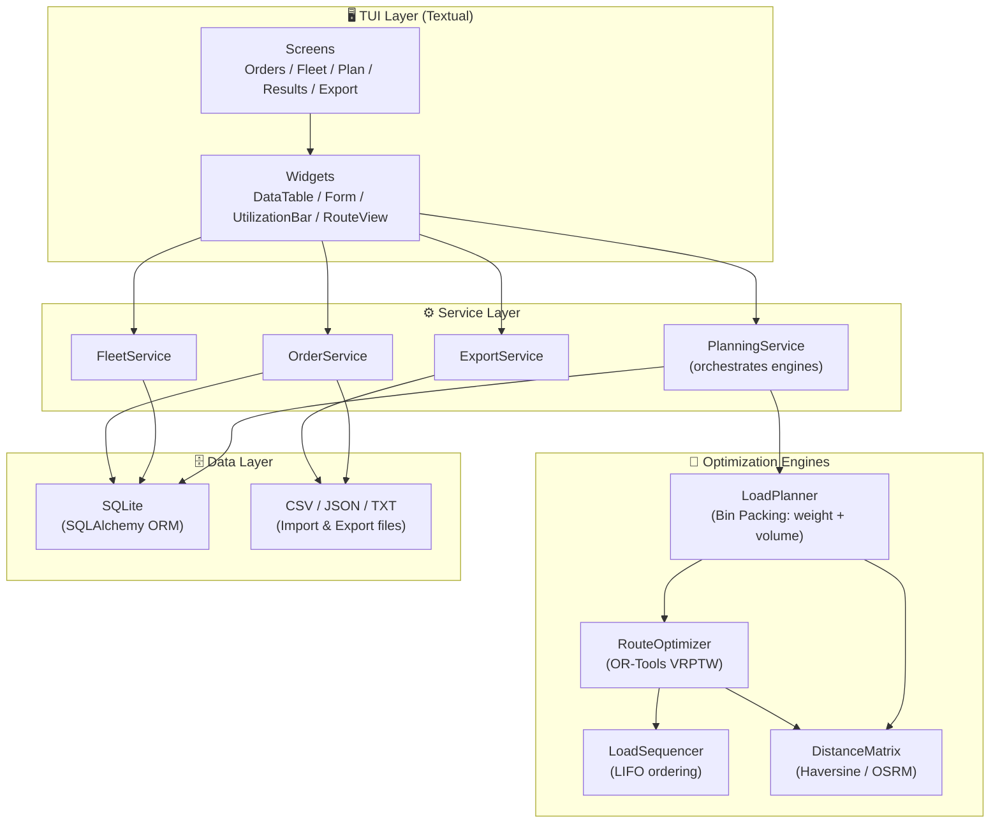
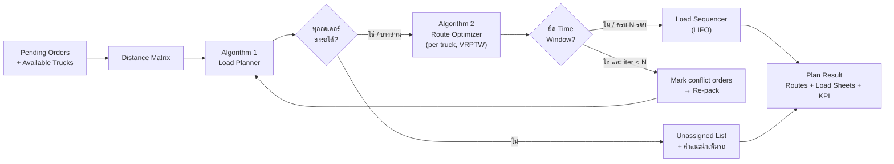

# 📋 Software Requirements Specification 2.0
## Truck Load & Route Optimization System (TUI Edition)

---

## 0. สรุปการเปลี่ยนแปลงจาก v1.1 → v2.0

| หัวข้อ | v1.1 (เดิม) | v2.0 (ใหม่) |
|--------|-------------|-------------|
| **ส่วนแสดงผล** | Web App (HTML/JS + Leaflet + Chart.js) | **TUI (Terminal User Interface)** เท่านั้น |
| **Backend/API** | FastAPI REST API | ไม่มี API — เรียก Service Layer ตรงจาก TUI |
| **Database** | PostgreSQL + PostGIS | SQLite (ไฟล์เดียว, ไม่ต้องรัน Server) |
| **แผนที่** | Leaflet.js Map | ไม่มีแผนที่ — แสดงเป็นตาราง / ลำดับจุดส่ง / ASCII |
| **อัลกอริทึม** | Route Optimization อย่างเดียว | **2 อัลกอริทึม:** (1) Load Planning (2) Route Optimization |
| **รูปแบบขนส่ง** | Parcel Delivery (Shopee-style, รถไม่เต็ม) | **Truck Freight (โหลดเต็มคัน / FTL)** |
| **Authentication** | Basic Login | ไม่มี (ใช้งานเครื่องเดียว) |
| **Responsive / Browser** | Chrome, Firefox, Mobile | Terminal บน Windows / Linux |

---

## 1. Executive Summary

**ชื่อโปรเจกต์:** Truck Load & Route Optimizer (TLRO)

**วัตถุประสงค์:** โปรแกรมแบบ Terminal (TUI) ที่ช่วยผู้จัดคิวรถบรรทุก **จัดของขึ้นรถให้เต็มคัน** และ **จัดลำดับจุดส่ง** อัตโนมัติ โดยใช้อัลกอริทึม Bin Packing (จัดโหลด) และ VRPTW (จัดเส้นทาง) เพื่อลดจำนวนรถที่ต้องใช้และลดระยะทางรวม

### 1.1 ความแตกต่างระหว่างขนส่งพัสดุกับขนส่งรถบรรทุก (เหตุผลที่ต้องออกแบบใหม่)

| ประเด็น | 📦 Parcel Delivery (Shopee / Kerry) | 🚚 Truck Freight (ระบบนี้) |
|--------|-------------------------------------|---------------------------|
| ลักษณะสินค้า | ชิ้นเล็ก น้ำหนักเบา จำนวนมาก | ลัง / พาเลท หนักและกินพื้นที่ |
| จำนวนจุดส่งต่อคัน | 50–150 จุด | 3–15 จุด |
| การใช้ความจุรถ | ไม่เต็มอยู่แล้ว (จำกัดด้วยเวลา ไม่ใช่พื้นที่) | **ต้องโหลดให้เต็ม** ทั้งน้ำหนักและปริมาตร |
| ตัวแปรที่ต้อง Optimize หลัก | ระยะทาง / เวลา | **จำนวนรถที่ใช้ + Utilization** แล้วค่อยระยะทาง |
| ข้อจำกัดที่สำคัญ | Time Window | น้ำหนักสูงสุด, ปริมาตร, **ลำดับการโหลด (LIFO)**, Time Window |
| ผลของการจัดไม่ดี | ส่งช้า | **รถวิ่งครึ่งคัน = เสียค่าเที่ยวฟรี** / ของล้นต้องออกรถเพิ่ม |

> **สรุป:** ระบบพัสดุถามว่า *"ไปทางไหนเร็วสุด"* แต่ระบบรถบรรทุกต้องถามก่อนว่า *"ของทั้งหมดนี้ใช้รถกี่คัน แต่ละคันใส่อะไร"* แล้วจึงถามว่า *"แต่ละคันไปทางไหน"*

### 1.2 ปัญหาที่แก้

**ข้อจำกัดเรื่องการบรรจุ (Load):**
รถกระบะ / รถหกล้อ / รถสิบล้อ แต่ละคันรับน้ำหนักและปริมาตรได้จำกัด คนจัดคิวมักคาดคะเนพื้นที่ด้วยสายตา ทำให้รถบางคันของล้นต้องเอาลง รถบางคันวิ่งครึ่งคัน สิ้นเปลืองค่าเที่ยว และของที่ต้องส่งก่อนกลับถูกฝังอยู่ก้นรถ ต้องขนของลงมาค้นหน้าร้าน

**ข้อจำกัดเรื่องเวลา:**
ลูกค้า A บังคับส่งก่อน 10 โมง, ลูกค้า B ห้ามรถใหญ่เข้าช่วงบ่าย คนจัดคิวคำนวณไม่ทัน ส่งเลยเวลาถูกตำหนิหรือหักเงิน

### 1.3 โซลูชัน

- **TUI Application** รับข้อมูลออเดอร์ (CSV / กรอกมือ) และข้อมูลรถ
- **Load Planning Engine** จัดกลุ่มออเดอร์ลงรถให้เต็มคัน ใช้รถน้อยที่สุด
- **Route Optimization Engine** จัดลำดับจุดส่งของแต่ละคันตาม Time Window
- **Loading Sequence** บอกคนขนของว่าต้องเอาอะไรขึ้นรถก่อน-หลัง (ของส่งท้ายสุดขึ้นก่อน)
- แสดงผลเป็นตาราง + Utilization Bar ใน Terminal และ Export CSV / JSON / Route Sheet (text)

---

## 2. Scope

### ✅ In Scope

| ฟีเจอร์ | รายละเอียด |
|--------|-----------|
| **📥 Input Order Data** | รับข้อมูลออเดอร์ผ่าน CSV หรือฟอร์มใน TUI |
| **📍 Customer Location** | จัดเก็บ latitude / longitude ของลูกค้า |
| **⏰ Time Window** | ช่วงเวลารับสินค้า + ข้อจำกัดประเภทรถ (เช่น ห้ามรถใหญ่หลังเที่ยง) |
| **📦 Cargo Spec** | น้ำหนัก (kg), ปริมาตร (m³) หรือขนาด กxยxส, จำนวนชิ้น, ซ้อนทับได้หรือไม่ |
| **🚚 Fleet Management** | จัดการรถ: ทะเบียน, ประเภท, น้ำหนักบรรทุกสูงสุด, ปริมาตรกระบะ, สถานะ |
| **🧮 Load Planning** | จัดออเดอร์ลงรถให้เต็มคัน (Bin Packing 2 มิติ: น้ำหนัก + ปริมาตร) |
| **🗺️ Route Optimization** | จัดลำดับจุดส่งของแต่ละคันด้วย OR-Tools (VRPTW) |
| **🔄 Loading Sequence** | คำนวณลำดับการขึ้นของแบบ LIFO ตามเส้นทาง |
| **🖥️ TUI Display** | เมนู, ตาราง, Utilization Bar, รายละเอียดเส้นทาง ใน Terminal |
| **💾 Export** | JSON / CSV / Route Sheet (.txt) สำหรับคนขับและคนขนของ |

### ❌ Out of Scope

- Web / Mobile Application, REST API
- แผนที่แบบกราฟิก (Leaflet, Google Maps)
- 3D Bin Packing แบบละเอียด (จัดวางตำแหน่งกล่องเป็นพิกัด x, y, z)
- GPS Tracking รถแบบ Real-time
- ระบบผู้ใช้หลายคน / Authentication
- การคิดค่าน้ำมัน / ค่าจ้างคนขับแบบละเอียด (แสดงเป็นค่าประมาณเท่านั้น)

---

## 3. Functional Requirements

### 3.1 Module: Order Management

```
FR1: Import Orders (CSV)
├── FR1.1: อ่านไฟล์ CSV (order_id, customer_name, lat, lon,
│         weight_kg, volume_m3 [หรือ length,width,height,qty],
│         time_start, time_end, stackable, vehicle_restriction, phone)
├── FR1.2: Validate: ค่า null, GPS ผิดช่วง, น้ำหนัก ≤ 0, time_end < time_start
├── FR1.3: แสดง Preview เป็นตารางใน TUI พร้อม Highlight แถวที่ error
└── FR1.4: ผู้ใช้กด Confirm / Cancel

FR2: Manual Order Entry
├── FR2.1: ฟอร์มใน TUI กรอกออเดอร์ทีละใบ
├── FR2.2: เลือก Customer จากรายการ (ค้นหาด้วยชื่อ) หรือสร้างใหม่
├── FR2.3: กรอก Weight, Volume (หรือ Dimensions ให้ระบบคำนวณ m³)
├── FR2.4: กรอก Time Window และ Vehicle Restriction (เช่น ≤ 6 ล้อ)
└── FR2.5: ระบุ Stackable (ซ้อนทับได้/ไม่ได้) และ Notes

FR3: View / Manage Orders
├── FR3.1: ตารางออเดอร์ทั้งหมด สถานะ pending / planned / exported
├── FR3.2: ค้นหา / Filter ด้วย Customer, Order ID, สถานะ
├── FR3.3: ลบ / แก้ไขออเดอร์
└── FR3.4: แสดงยอดรวม: น้ำหนักรวม, ปริมาตรรวม, จำนวนจุดส่ง
```

### 3.2 Module: Fleet Management

```
FR4: Vehicle Management
├── FR4.1: สร้าง / แก้ไข / ลบข้อมูลรถ
├── FR4.2: ฟิลด์: License Plate, Vehicle Type (4 ล้อ / 6 ล้อ / 10 ล้อ),
│         Max Weight (kg), Cargo Volume (m³), Cargo Dimensions (กxยxส),
│         Fixed Cost per Trip (บาท), Cost per km (บาท)
├── FR4.3: ตั้งค่า Depot (พิกัด GPS, เวลาออกรถเร็วสุด, เวลากลับช้าสุด)
└── FR4.4: แสดงรายการรถพร้อมใช้

FR5: Fleet Status
├── FR5.1: สถานะรถ: Available / Assigned / Maintenance
└── FR5.2: อัปเดตสถานะแบบ Manual
```

### 3.3 Module: Load Planning (อัลกอริทึมที่ 1 — จัดโหลด)

```
FR6: Load Planning
├── FR6.1: Input: ออเดอร์ pending ทั้งหมด + รถที่ Available
├── FR6.2: Constraint: Σ weight ≤ Max Weight และ Σ volume ≤ Cargo Volume
│         ของรถแต่ละคัน (Multi-dimensional Bin Packing)
├── FR6.3: Constraint: Vehicle Restriction ของลูกค้า
│         (ออเดอร์ที่ห้ามรถใหญ่ ต้องอยู่ในรถเล็ก)
├── FR6.4: Objective หลัก: ใช้รถน้อยคันที่สุด (Minimize Vehicles)
├── FR6.5: Objective รอง: จัดออเดอร์ที่อยู่ใกล้กันลงรถคันเดียวกัน
│         (Geographic Affinity — ใช้ระยะทางระหว่างจุดเป็น cost)
├── FR6.6: ตั้งค่า Target Utilization ได้ (default 85%)
│         รถที่ต่ำกว่า Target ต้องแจ้งเตือนสีเหลือง
├── FR6.7: ถ้าเหลือของที่ใส่ไม่ลง → รายงาน Unassigned Orders
│         พร้อมบอกว่าขาดน้ำหนัก/ปริมาตรอีกเท่าไร
└── FR6.8: ผู้ใช้ย้ายออเดอร์ข้ามรถได้เอง (Manual Override) แล้วระบบ
          Re-validate ความจุทันที

FR7: Loading Sequence (LIFO)
├── FR7.1: หลังได้เส้นทางจาก FR8 ให้เรียงลำดับการขึ้นของ = ย้อนกลับ
│         ลำดับส่ง (ของส่งจุดสุดท้าย → ขึ้นรถก่อน อยู่ก้นรถ)
├── FR7.2: ของที่ Stackable = false ต้องถูกระบุว่า "วางบนสุด / ห้ามทับ"
├── FR7.3: แสดง Load Sheet: ลำดับ | Order | ลูกค้า | น้ำหนัก | ปริมาตร |
│         ตำแหน่ง (ก้นรถ / กลาง / ท้ายรถ)
└── FR7.4: แสดง Utilization Bar น้ำหนักและปริมาตรต่อคัน
```

### 3.4 Module: Route Optimization (อัลกอริทึมที่ 2 — จัดเส้นทาง)

```
FR8: Route Optimization
├── FR8.1: Input: ผลจัดโหลด (รถ → ชุดออเดอร์) + Distance/Time Matrix
├── FR8.2: ใช้ OR-Tools Routing Solver แก้ VRPTW โดยตรึง Assignment
│         จาก Load Planning (แต่ละคันจัดลำดับจุดส่งของตัวเอง)
├── FR8.3: Constraint: Time Window ของลูกค้า, Service Time ต่อจุด
│         (เวลาลงของ ขึ้นกับน้ำหนัก), เวลาออก-กลับ Depot
├── FR8.4: Objective: Minimize ระยะทางรวม / เวลารวม
├── FR8.5: Timeout ตั้งค่าได้ (default 30 วินาที) คืน Best Solution ที่หาได้
├── FR8.6: ใช้ Guided Local Search เป็น Metaheuristic
└── FR8.7: Distance Matrix: Haversine (default, offline) หรือ OSRM
          (optional, ถ้ามี internet / self-hosted)

FR9: Feedback Loop (Load ↔ Route)
├── FR9.1: ถ้ารถคันใดจัดเส้นทางแล้วผิด Time Window
│         → ทำเครื่องหมายออเดอร์ที่ขัดแย้ง แล้วส่งกลับ Load Planning
│         ให้ย้ายไปคันอื่นที่ยังมีที่ว่าง
├── FR9.2: ทำซ้ำสูงสุด N รอบ (default 3) หรือจนไม่มีการเปลี่ยน
└── FR9.3: ถ้ายังไม่ได้ → รายงาน Infeasible พร้อมคำแนะนำ

FR10: Handle Infeasible Cases
├── FR10.1: กรณีของเกินรถ: "ต้องเพิ่มรถอีก X คัน (ประมาณ Y kg / Z m³)"
├── FR10.2: กรณี Time Window ชนกัน: "ขยาย Time Window ของออเดอร์ #.., #.."
├── FR10.3: กรณี Vehicle Restriction: "ออเดอร์ #.. ต้องใช้รถ ≤ 6 ล้อ แต่ไม่มีว่าง"
└── FR10.4: อนุญาตให้ Run แบบ "Partial" คือจัดเท่าที่ทำได้ ที่เหลือแสดงเป็น
           Unassigned
```

### 3.5 Module: TUI Display

```
FR11: Main Menu & Navigation
├── FR11.1: เมนูหลัก: [1] Orders [2] Fleet [3] Plan & Optimize
│          [4] Results [5] Export [6] Settings [Q] Quit
├── FR11.2: ควบคุมด้วยคีย์บอร์ด (ลูกศร, Enter, Esc, ตัวอักษรลัด)
└── FR11.3: แสดง Status Bar ล่างจอ: จำนวน pending orders, รถว่าง, DB path

FR12: Results Screen
├── FR12.1: Summary Panel: จำนวนรถที่ใช้ / ทั้งหมด, ระยะทางรวม,
│          Avg Utilization (น้ำหนัก, ปริมาตร), Unassigned
├── FR12.2: ตารางต่อคัน: Truck | Type | Stops | Weight % | Volume % |
│          Distance | Depart | Return | ⚠ Warnings
├── FR12.3: Utilization Bar เช่น
│          Weight  [████████████████░░░░]  82%  (4,100 / 5,000 kg)
│          Volume  [██████████████████░░]  91%  (18.2 / 20.0 m³)
├── FR12.4: กด Enter ที่รถ → Route Detail:
│          Seq | Order | Customer | Arrive | Window | Wait | Unload | Dist
├── FR12.5: Tab สลับไป Load Sheet (ลำดับขึ้นของ LIFO)
└── FR12.6: แสดง Route แบบ ASCII: DEPOT ──▶ C3 ──▶ C7 ──▶ C1 ──▶ DEPOT

FR13: Before / After Comparison (KPI)
├── FR13.1: เปรียบเทียบกับ Baseline (จัดตามลำดับ order_id แบบ First-Fit)
├── FR13.2: จำนวนรถ, ระยะทางรวม, Avg Utilization, On-time %
└── FR13.3: ประมาณต้นทุน = Σ(Fixed Cost + km × Cost/km) ก่อน vs หลัง
```

### 3.6 Module: Export

```
FR14: Export Results
├── FR14.1: JSON (โครงสร้างเต็ม: plan, routes, load_sheets, kpi)
├── FR14.2: CSV (1 แถว = 1 stop: truck, seq, order, customer, arrive, weight, volume)
├── FR14.3: Route Sheet .txt ต่อคัน สำหรับคนขับ (ลำดับจุดส่ง + เบอร์โทร + เวลา)
└── FR14.4: Load Sheet .txt ต่อคัน สำหรับคนขนของ (ลำดับขึ้นของ + คำเตือนห้ามทับ)
```

---

## 4. Non-Functional Requirements

| ด้าน | ความต้องการ | รายละเอียด |
|------|-----------|-----------|
| **Performance** | Load Planning | ≤ 5 วินาที สำหรับ 100 ออเดอร์ / 10 คัน |
| **Performance** | Route Optimization | ≤ 30 วินาที (Timeout ตั้งค่าได้) |
| **Performance** | TUI Response | หน้าจอตอบสนอง ≤ 100 ms ทุก Action (งานหนักรันใน background thread + แสดง progress) |
| **Scalability** | ขนาดปัญหา | 50–150 ออเดอร์, 3–20 คัน ต่อการรันหนึ่งครั้ง |
| **Offline** | การทำงาน | ต้องทำงานได้โดยไม่มี Internet (Haversine + SQLite) |
| **Persistence** | Database | SQLite ไฟล์เดียว, เก็บทุกแผนที่รันไว้ดูย้อนหลัง |
| **Usability** | UI | ใช้คีย์บอร์ดล้วน, มี Help (กด `?`) ทุกหน้าจอ, ข้อความภาษาไทย/อังกฤษ |
| **Compatibility** | Terminal | Windows Terminal / PowerShell, Linux (bash), ขนาดขั้นต่ำ 100×30 ตัวอักษร, รองรับ UTF-8 |
| **Reliability** | Data Safety | บันทึกลง DB ทุกครั้งที่ Confirm, ไม่มีการเสียข้อมูลเมื่อปิดโปรแกรมกลางคัน |
| **Documentation** | Code | Docstring ทุกฟังก์ชันสำคัญ โดยเฉพาะใน `engine/` |

---

## 5. System Architecture

### 5.1 High-Level Architecture



### 5.2 Optimization Pipeline



### 5.3 Project Structure

```
📁 tlro/
├── main.py                     # Entry point: python -m tlro
├── config.py                   # Settings (DB path, defaults, timeout)
│
├── tui/
│   ├── app.py                  # Textual App, routing between screens
│   ├── screens/
│   │   ├── orders.py           # Order list / import / form
│   │   ├── fleet.py            # Vehicle list / form / depot
│   │   ├── plan.py             # Run optimization + progress
│   │   ├── results.py          # Summary, per-truck detail, load sheet
│   │   └── export.py
│   └── widgets/
│       ├── utilization_bar.py  # [████░░] 82%
│       ├── route_view.py       # DEPOT ──▶ C3 ──▶ ...
│       └── forms.py
│
├── services/
│   ├── order_service.py
│   ├── fleet_service.py
│   ├── planning_service.py     # Orchestrates the pipeline (5.2)
│   └── export_service.py
│
├── engine/
│   ├── distance.py             # Haversine matrix / OSRM client
│   ├── load_planner.py         # Algorithm 1: bin packing
│   ├── route_optimizer.py      # Algorithm 2: OR-Tools VRPTW
│   ├── load_sequencer.py       # LIFO loading order
│   └── baseline.py             # Naive first-fit for KPI comparison
│
├── db/
│   ├── models.py               # SQLAlchemy models
│   ├── database.py             # Session / init
│   └── schema.sql
│
├── utils/
│   ├── csv_io.py
│   ├── validation.py
│   └── logger.py
│
├── tests/
├── sample_data/
│   ├── orders_sample.csv
│   └── vehicles_sample.csv
└── requirements.txt
```

---

## 6. Algorithm Specification

### 6.1 Algorithm 1: Load Planner (Multi-dimensional Bin Packing)

**Input**
- ออเดอร์ $$i$$: น้ำหนัก $$w_i$$, ปริมาตร $$v_i$$, พิกัด, ข้อจำกัดประเภทรถ $$R_i$$
- รถ $$k$$: $$W_k$$ (max weight), $$V_k$$ (max volume), ประเภท $$t_k$$, ค่าเที่ยว $$F_k$$

**Constraints**

\[
\sum_{i \in k} w_i \le W_k, \qquad \sum_{i \in k} v_i \le V_k, \qquad t_k \in R_i \ \forall i \in k
\]

**Objective**

\[
\min \sum_{k} F_k \cdot y_k \;+\; \lambda \sum_{k}\sum_{i,j \in k} d_{ij}
\]

โดย $$y_k = 1$$ ถ้าใช้รถคัน $$k$$, $$d_{ij}$$ คือระยะทางระหว่างจุดส่ง, $$\lambda$$ คือน้ำหนักถ่วง (ให้ "ใช้รถน้อย" สำคัญกว่า "ของอยู่ใกล้กัน")

**Method (2 ระดับ)**
1. **Heuristic เร็ว (default):** Best-Fit Decreasing เรียงออเดอร์จาก "ค่าครอบครอง" $$\max(w_i/W, v_i/V)$$ มาก→น้อย ใส่ลงรถที่เหลือที่พอดีที่สุด และมี centroid ใกล้ที่สุด
2. **Exact / Improve (optional):** OR-Tools CP-SAT แก้ Bin Packing เมื่อออเดอร์ ≤ 60 ใบ หรือใช้ปรับปรุงผลจาก Heuristic ภายในเวลาที่กำหนด

**Output:** `assignment: {vehicle_id: [order_ids]}`, `unassigned: [order_ids]`, utilization ต่อคัน

### 6.2 Algorithm 2: Route Optimizer (VRPTW ด้วย OR-Tools)

- สร้าง Routing Model **ต่อรถหนึ่งคัน** (TSPTW) หรือ Model รวมโดยตรึง Assignment ด้วย `SetAllowedVehiclesForIndex`
- Dimension `Time`: travel time + service time (คำนวณจากน้ำหนัก: $$s_i = s_0 + \alpha \cdot w_i$$)
- Time Window ที่ node ลูกค้า, Depot มี window เวลาออก–กลับ
- Objective: minimize arc cost (ระยะทาง) + penalty การรอ
- First Solution: `PATH_CHEAPEST_ARC`, Metaheuristic: `GUIDED_LOCAL_SEARCH`, Time limit ตาม config
- ถ้าไม่พบ solution → รายงานว่าออเดอร์ใดทำให้ infeasible (ใช้ drop-penalty node) ส่งกลับ Load Planner

### 6.3 Load Sequencer (LIFO)

```
route  = [Depot, C3, C7, C1, Depot]
unload = [C3, C7, C1]
load   = reversed(unload) = [C1, C7, C3]   # C1 ขึ้นก่อน → ก้นรถ, C3 ขึ้นสุดท้าย → ท้ายรถ
```
- แบ่งโซนตามสัดส่วนปริมาตรสะสม: 0–33% = ก้นรถ, 33–66% = กลาง, 66–100% = ท้ายรถ
- ออเดอร์