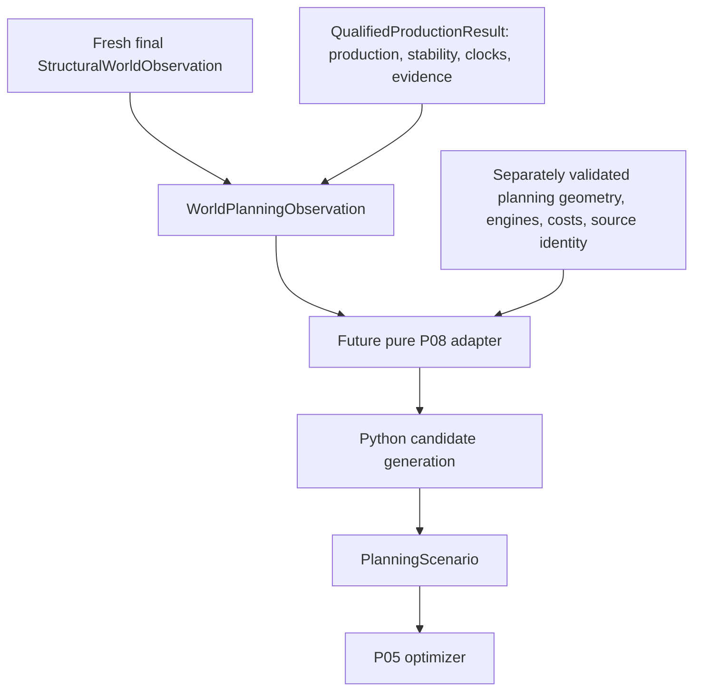

# WorldPlanningObservation design and P08 audit

Design and local-code audit, 2026-10-08. Architecture authority: local
`CONTEXT.md`. Baseline: `6a0da37fe2d43c5937fc14279816dfa5af79472e`,
`feat(openttd): prove qualified production observation`.

**WorldPlanningObservation is design-only. The P08 adapter is not implemented.**
This audit preserves the existing local P08 work rather than adopting it as
current authority. No source models, candidate generation, P05, historical evidence,
or frozen contracts are changed.

## 1. Current proven pipeline and authority

Real OpenTTD 15.3 qualification Attempt 4 under V5 passed: one continuous
process and encrypted Admin connection, adjacent M0→M1→M2 economy rollovers,
complete M1 anchor and fresh M2 structure/production, exact target stability,
relevant lifetime/fingerprint stability, complete qualified production, exact
structural source digest, cleanup, integrity, lineage, and offline acceptance.
Earlier failed attempts remain failed. This does not prove P08 integration,
an atomic snapshot, or an independent production source.

Existing authorities inspected:

- [Structural observation](../app/simulation/openttd/structural_world.py),
  [inventory](../app/simulation/openttd/industry_inventory.py),
  [industry records](../app/simulation/openttd/industry_page.py),
  [capabilities](../app/simulation/openttd/industry_capability.py), and
  [cargo records](../app/simulation/openttd/cargo_page.py).
- [Production observation](../app/simulation/openttd/production_observation.py),
  [qualification state](../app/simulation/openttd/qualification_state.py),
  [stability](../app/simulation/openttd/qualification_stability.py), and
  [coordinator/result](../app/simulation/openttd/qualification_session.py).
- [Planning domain](../app/planning/domain.py),
  [canonical identities](../app/planning/canonical.py),
  [validation](../app/planning/validation.py), and
  [optimizer](../app/planning/optimizer.py).
- [Earlier dynamic-supply design](industry-production-dynamic-supply-design.md),
  which already proposes WorldPlanningObservation. This document refines that
  proposal against the implemented, now-proven qualification model; it does not
  introduce another competing observation abstraction.



## 2. Purpose, placement, and proposed schema

The boundary asserts: this final structural world and qualified dynamic supply
are coherent enough for planning preparation. It neither queries nor executes
OpenTTD; it does not poll, generate facilities/routes/fleets, run Dijkstra or
OR-Tools, estimate demand, or import P08.

Proposed placement: `app/simulation/openttd/world_planning_observation.py`, beside
native observation models. `app/planning/domain.py` remains the independent
planner contract. Planning adapters depend on the observation boundary; native
observation modules must not depend on preparation or planner implementation.

Proposed immutable schema, not executable code:

```text
WorldPlanningObservation [frozen]
    structural: StructuralWorldObservation
    qualification: QualifiedProductionResult

    production -> qualification.production                   [derived reference]
    qualified_month_identity -> qualification.qualified_month_identity
    context -> structural.context                            [derived reference]
    complete -> true only after all admission validations
    composition_digest -> canonical semantic identity described below
```

Composition is the decision. Preserve the exact immutable observations and
qualification witness; do not flatten/copy their records or create another
world/provenance/qualified-month DTO. The existing public digest property is
`structural_world_digest`, not a literal `structural.digest` field.

**Why the complete qualification result is required:** production's
`qualified_for_planning` currently means complete records plus three adjacent
`ProductionWindowQualification` months. That flag alone does not establish target
stability, lifetime stability, actual clock receipts, or final guard. Existing
`QualifiedProductionResult` validates these stronger facts. Do not introduce an
alternate constructor accepting arbitrary records plus a caller-supplied true flag.

**Why no model implementation in this task:** the result is declared in the
coordinator module, which imports `GameScriptTransport`; structural component
modules also combine domain models with query/session imports. Merely importing
these current classes transitively imports transport/Admin-related modules.
A small wrapper would not meet the requested import boundary. A future controlled
refactor should separate existing immutable types from transport/session modules,
with compatibility exports and unchanged serialization/digests. This audit does
not undertake that refactor or pretend TYPE_CHECKING-only annotations solve
runtime admission validation.

## 3. Admission gates and exact references

A single validated construction path must:

1. Require the authoritative typed immutable structural and qualification objects;
   revalidate their existing invariants rather than trust serialized flags.
2. Require structural completeness, production completeness, and
   `production.qualified_for_planning is True`.
3. Require nonmissing qualification metadata and nonmissing exact
   `production.source_structural_world_digest == structural.structural_world_digest`.
4. Require the supplied structure to be the qualification result's final M2
   structure and production source, rather than the M1 anchor. For live composition,
   require the same authoritative object references. A later persisted-evidence
   loader must reconstruct and revalidate that relationship explicitly; there is
   no unchecked JSON/dict constructor.
5. Apply existing `StructuralWorldContext.require_same_run`: process identity
   and connection identity use object identity; world identity, runtime identity,
   configuration digest and bridge digest must match. This is stronger than
   comparing semantic digests. No duplicate process/runtime/world fields are added.
6. Validate full qualification evidence: bounded adjacent rollovers, coherent
   anchor/final reads, exact targets, relevant lifetime/fingerprints, fresh complete
   production, receipt/liveness evidence, final M2 guard and no third rollover.
7. Resolve every production industry against final inventory and every cargo
   against final catalog. Every pair must occur in final `produces`, with exact
   sorted coverage, no duplicate, missing, accepted-only, or extra pair.

Existing `production_pairs`, structural constructors, production constructor,
`TargetStability`, `QualifiedProductionVerification`, and `QualifiedProductionResult`
are the validation authorities. Reuse them rather than create relaxed validators.
No `force`, `unsafe`, `allow_unqualified`, partial-success, or silent record dropping.

For retained *real* evidence, the trusted issuer/loader must additionally validate
final proof acceptance, cleanup and immutable evidence identity. Native qualification
alone is not overall acceptance, as Attempts 2 and 3 demonstrated. WPO should not
read files or execute proofs itself. A controlled typed fixture is not a real-proof
attestation. Designing an accepted-evidence importer is a separate required seam:
opaque process/connection handles cannot simply be reconstructed from JSON strings.

## 4. Temporal and supply semantics

M1 is the fully bounded qualified economy month. M2 is the fresh final structure
and production capture month. Preserve `QualifiedMonthIdentity` and its native
rollover boundaries; per-record `economy_date_before`/`economy_date_after` are M2
capture brackets, not M1 boundaries. Relevant `GSIndustry.GetConstructionDate`
is a calendar construction identity, not economy-time qualification evidence.

The stability contract checks exact produced target pairs and relevant producing
industry fingerprints/lifetimes. It does **not** require every anchor and final
structural digest to be identical, nor does it establish lifetime stability for
accepting-only industries. The final M2 structure remains the planning anchor.

Production records retain `industry_id`, `cargo_id`, `last_month_produced`,
`last_month_transported`, and `last_month_transported_pct`, with their existing
native semantics. Raw production is qualified historical quantity. Station
allocation is not vehicle pickup, successful delivery, destination throughput,
or guaranteed available inventory. Do not subtract allocation to invent usable
supply; do not recompute percentages or infer a counter invariant that native
bounded counters do not guarantee. `production_level` remains excluded.

The future adapter uses qualified raw production as its quantitative source,
with a separate explicit projection policy. Copying one month into a mandatory
horizon demand is a historical benchmark policy, not observed consumption or a
forecast. Horizon units/calendar conversion and any rate normalization must be
named and versioned outside WPO. Capability establishes a relationship, not a
positive quantity. Acceptance establishes potential eligibility, not consumption.

Zero raw production is valid. A complete qualified zero-target observation is
also valid under the existing qualification contract. WPO admits both. Current
P05 requires positive demands and nonempty fleets/candidates; a road-first adapter
may report `NO_PLANNABLE_SUPPLY` when no positive selectable OD exists. It must
not invalidate the observation, manufacture supply, or omit zero records from it.

## 5. Identity and composition digest decision

Keep all existing identities:

| Identity | Meaning | WPO relationship |
|---|---|---|
| Structural digest | Canonical observed inventory/capabilities/catalog plus stable runtime/map/config/bridge identities | Authoritative final planning structure |
| Production digest | Canonical production records, structural source, qualification/window semantics | Authoritative dynamic supply |
| Context process/connection/world | Continuous same-run ownership and provenance | Mandatory admission, not recreated hashes |
| Manifest `source_digest` | Current P08's actual prepared-save digest, checked by save staging | Separate downstream source contract |
| `world_manifest_hash` / `world_fingerprint` | Full prepared manifest semantic identity | Preserve downstream P02/P03/P05/P06/P07 bindings |
| Scenario hash | Complete supplied planner inputs | Remains P05 input identity |

A WPO composition digest is useful and proposed. Exact version-1 semantic payload:

```text
schema = "world-planning-observation-v1"
structural_world_digest = final structural digest
production_digest = qualified production digest
qualified_month = {economy_year, economy_month, start_date, end_date}
relevant_industry_lifetimes = sorted [{industry_id, construction_date}, ...]
```

Use canonical UTF-8 JSON, sorted keys, compact separators and SHA-256. Version 1
binds the current restricted qualification profile; a policy change requires a new
schema version. Month end dates are exclusive, as in the existing EconomyMonth. Dates
come from the existing native bounded month; lifetime entries come from validated
final relevant lifetime readings. This adds a composition identity rather than
another world fingerprint. Stable runtime/config/bridge/map semantics are already
in the structural identity. Lifetime entries prevent this composition identity
from discarding replacement-relevant identity absent from ordinary inventory.

Exclude request IDs, object addresses, paths, runtime directories, evidence paths,
wall-clock timestamps, pagination, polling cadence, and receipt ordering. Existing
component digest semantics remain unchanged, including the production digest's
existing qualification-month representation. Equal semantics may yield equal
composition digests across separate executions; the digest is not a substitute
for same-run provenance or proof acceptance. Hashing is not implemented here.

## 6. P08 implementation and file classification

All preparation files below are **pre-existing untracked local work**, not current
15.3 authority. Classification describes reuse prospects, not an instruction to
modify or delete them. Mixed files have their reusable and superseded roles noted.

| Component/file | Current role | Classification / 13.4-specific? | Problem | Future action |
|---|---|---|---|---|
| `preparation/__init__.py` | Package marker | REUSABLE PURE PYTHON; no | No observation interface | Retain package boundary if adopted |
| `preparation/domain.py` | Frozen request, profile, extraction, provenance/bundle DTOs | REUSABLE WITH CHANGES; profile 13.4-SPECIFIC | Raw production and extraction/save policy mixed; no qualification witness | Keep strict bounds; split planner facts from native extraction and obsolete supply fields |
| `preparation/canonical.py` | Canonical request/snapshot/report/bundle hashing | REUSABLE WITH CHANGES; schemas indirectly 13.4 | Old snapshot identity; report sorting role-only | Preserve canonical discipline; version new input identities |
| `preparation/candidates.py` | Select one positive OD; station catchment/depot candidates | REUSABLE WITH CHANGES; profile-dependent | Supply uses unqualified last-month value; accepting flag is not demand | Keep geometry algorithms; replace supply source through future adapter |
| `preparation/corridor.py` | Bounded deterministic flat-road Dijkstra | REUSABLE PURE PYTHON; no inherent version | Needs verified tiles/fronts/depot; narrow policy | Retain algorithm and explicit limits after input adaptation |
| `preparation/costs.py` | Exact fixed-point cost scaling and bounds | REUSABLE PURE PYTHON; no | Native price provenance remains external | Retain numeric validation |
| `preparation/failures.py` | Typed bounded failures, no accepted partial output | REUSABLE PURE PYTHON; no | Needs observation/missing-fact failures | Extend deliberately in future adapter task |
| `preparation/projection.py` | Validate extraction; fleet/candidate/manifest/scenario construction | REUSABLE WITH CHANGES; hard 13.4 gate | Snapshot source, speed conversion, save/profile and raw supply coupled | Retain assembly checks; redesign input seam, do not silently change pins |
| `preparation/safety.py` | Validate every selectable combination via controlled P05/P06 witnesses | REUSABLE WITH CHANGES; engine/profile dependent | Imports execution-payload validation; not WPO domain | Keep outside observation boundary; revalidate 15.3 assumptions |
| `preparation/probe.py` | Parse sequential bounded console frames/checksum | 13.4-SPECIFIC in present contract; parser patterns reusable | Console extraction duplicates proven inputs; checksum not qualification | Do not use as new supply authority |
| `probe_package/info.nut` | GS API 13 package metadata | 13.4-SPECIFIC | Not 15.3 observation bridge | Preserve historical local work |
| `probe_package/main.nut` | Paused single-player industry/cargo/terrain/engine/cost probe | 13.4-SPECIFIC; extraction parts DUPLICATED BY 15.3 OBSERVATION PIPELINE | Independently reads raw production; incompatible paused/single-player/company assumptions | Replace independent structure/supply collection; design missing-fact source separately |
| `preparation/lifecycle.py` | Injected runtime start, staged save/probe, cleanup and immutable publication | REUSABLE WITH CHANGES; historical extraction path OBSOLETE for new adapter | New pure adapter must not start another extraction runtime | Reuse publication/ownership patterns only where needed |
| `tests/fixtures/p08_api_13_4.json` | Tagged header declarations, arities and hashes | 13.4-SPECIFIC | Historical fixture does not establish 15.3 APIs | Preserve; separate future 15.3 authority |
| `tests/fixtures/p08_query_api.nut` | Fake API, company, paused world and synthetic production | 13.4-SPECIFIC | Controlled values cannot be planning supply authority | Preserve old regression fixture |
| `tests/test_planning_preparation.py` | Projection/candidate/determinism/P05/P06 controlled tests | REUSABLE WITH CHANGES | 13.4 fixtures, positive raw supply and conversion assumptions | Retain pure regressions; add qualified-source cases later |
| `tests/test_preparation_lifecycle.py` | Fake runtime cleanup, save identity and publication | REUSABLE WITH CHANGES | Synthetic saves and injected runtime, no native proof | Retain ownership/publication tests separately |
| `tests/test_preparation_probe.py` | Controlled Squirrel execution, parser and API-arity checks | 13.4-SPECIFIC | Fake APIs and static fixture cannot prove native 15.3 behavior | Preserve historical controlled tests |
| `docs/specs/p08-world-preparation-design.md` | Historical road-first preparation design | 13.4-SPECIFIC; old readiness direction OBSOLETE for new path | Old raw benchmark/probe authority | Preserve; this audit states replacement direction |
| `README.md`, `docs/specs/planning-executor-boundary.md`, `docs/srs.md` | Pre-existing modified P08 references/status | UNKNOWN / NEEDS DECISION for current P08 adoption | Local documentation is not accepted 15.3 integration | Preserve all current edits; update only in a later scoped task |
| Core planning `domain.py`, `canonical.py`, `validation.py`, `optimizer.py` | Accepted supplied-candidate P05 boundary | AUTHORITATIVE CURRENT | Requires facts beyond structural/production observations | Leave unchanged |
| Native structural/production/qualification models and accepted proof | Current 15.3 observation authority | AUTHORITATIVE CURRENT | Not a terrain/fleet/prepared-save extractor | Consume by composition |

No complete local file is declared disposable. OBSOLETE means the old extraction
path or current-readiness claim is unsuitable for the new path, not historical
records should be removed.

## 7. Historical 13.4 assumptions and extraction duplication

The old profile defaults to OpenTTD 13.4/OpenGFX 7.1, temperate/no NewGRF,
zero competing companies, road type 0, catchment radius 3, acceptance threshold 8.
`validate_snapshot` hard-gates 13.4 and OpenGFX name; the base-set version default
is not itself an exact 7.1 validation gate. A default must not be mistaken for
an observed or enforced identity.

The GS probe requires paused single-player state, an existing query company,
unchanged date, modified catchment and bounded map/profile. Current 15.3 proof
uses dedicated secure Admin ownership and advancing economy time. Old guards and
save/load semantics cannot be transferred to that lifecycle without new authority.
The API fixture cites 13.4 tagged headers; tests compare calls/arity against that
fixture and a fake Squirrel API. No old real proof was run in this audit.

Duplicate extraction: industry list, IDs, anchor locations, cargo catalog/freight
and produced/accepted relationships have proven 15.3 sources. Use final structural
inventory/capabilities/catalog, not a second P08 reconstruction. Old probe cargo
loops query production across all active cargo, not exact produced pairs; the
earlier dynamic-supply audit records the incompatible non-produced sentinel risk.
Old names/footprints, full tile facts and current catchment/acceptance predicates
are additional facts, not all duplicates. Structural capability `accepts` and
old `CAS_ACCEPTED` operational acceptance are different predicates.

Duplicate production: `main.nut` calls `GSIndustry.GetLastMonthProduction`;
`IndustryCargoFact.last_month_production` stores it; `select_demand` immediately
uses any positive value as benchmark quantity. No qualified month, two rollovers,
lifetime stability, exact source relation or final guard exists in that path.
This acceptance contract cannot tell seeded fresh-world history from qualified
historical production. Replace that source, without relabelling old fixtures.
Tile catchment production checks are source-presence predicates, not qualified
industry volume; they need separately verified geometry semantics.

The probe does not call construction, vehicle purchase, orders, terraform or
finance mutation methods. Company context is query scope. Its injected lifecycle
starts/loads/collects/saves an external runtime; it is not a pure adapter. Controlled
P06 witness/executor tests operate fake worlds and are not authorization to mutate
OpenTTD. Future adapter and candidate generation remain Python-only.

## 8. Candidate generation, supply/demand, identity and determinism

Old policy is one deterministic positive freight OD: ascending industry/cargo/
destination IDs, a distinct accepting destination, quantity copied from last-month
production, deadline horizon minus one. No observed destination consumption or
processing capacity is supplied. Produced capability does not imply nonzero supply;
acceptance does not prove demand. The explicit benchmark must remain visible.

Station candidates require flat vacant eligible terrain and native catchment
predicates; sample up to four spread candidates using deterministic sectors/ranks.
A shared depot requires compatible orientation/front connectivity. Corridors are
orthogonal, flat, loop-free tile paths through required fronts, with bounded labels,
fixed-point cost, path-length/turn tie-breaking and at most two alternatives.
Fleet filtering uses immediately available compatible non-articulated, non-refit
road engines with positive capacity. Cost/speed units (including 1.00584 speed
conversion and annual running-cost division by 365) belong to the old profile and
require independent 15.3 validation, not automatic reuse.

Ordering is explicit for industry/cargo selection, tile ranks, orientations,
engine IDs, heap priorities, path tie-breaking and final candidates. Corridor IDs
hash ordered tile paths. Set membership is used for exclusion/visited identity,
not arbitrary choice of the next candidate. Limits fail explicitly, rather than
truncating accepted output or dropping missing observations. No unseeded randomness
was found in these algorithms.

Seams to test before expansion: report station sampling sorts only by role; it
currently has one origin/destination. Nested industry cargo facts are also sorted by cargo ID through the canonical
`cargos` enumeration rule. Role-only report sorting would need a stronger key if
the policy expands to multiple OD relationships. This is an extension-contract
risk, not evidence that current bounded fixtures randomly change output. No
unrelated determinism repair is made here.

Industry references currently use numeric IDs plus manifest world fingerprint;
there is no construction/lifetime identity. Future provenance must carry final
structural digest and relevant native lifetime identity. Accepting-only industry
lifetime evidence is not supplied by qualification and must not be invented.
Cargo catalog labels are four native bytes encoded as uppercase eight-digit hex
in the 15.3 observation, whereas old P08 uses labels such as `COAL`. Future adapter
must define a lossless deterministic catalog mapping and collision/unsupported-label
failure; it must not treat hex as an already-compatible planner label.

Current facilities mostly reference request/scenario policy hashes; engines
reference snapshot/native engine IDs; report links origin/destination industry IDs.
This cannot fully answer which *qualified* industry/cargo relationship caused each
candidate. Future sidecar provenance should bind WPO digest, qualified month,
structural/production digests, native pair and relevant lifetime identity, with
compact SourceReference links on candidates. Do not copy whole observations into
all candidates.

## 9. PreparedWorldManifest responsibilities and fingerprint

The current manifest mixes observed/native pins and map dimensions; save-source
identity; planner origin/destination labels; numeric industry references; candidate
station/depot sites; selected cargo/vehicle labels; and eligible buildable tiles.
It is both a prepared-world identity and a candidate-generation output projection.
It does not carry qualification, dynamic supply, complete native observations,
costs or the entire fleet specification.

`world_manifest_hash` hashes canonical **all manifest fields**, including actual
prepared-save `source_digest`, runtime/base-set version, map/seed, resolved sites,
planner labels/facilities, cargo/vehicle sets and buildable tiles. Candidate policy
can change its output and therefore the fingerprint. It is not merely a hash of
save bytes and not the structural observation digest. Scenario hash additionally
covers demand quantities, fleet economics, candidate costs and policy inputs.

Keep manifest and fingerprint as the downstream P05/P02/P03/P06/P07 binding.
Move raw observation/qualification admission into WPO, and extraction provenance
into a separate accepted source/facts contract. Candidate-dependent manifest
construction stays after candidate generation. Add compact source links/sidecars
rather than overwrite its identity with a structural digest. The current transport
staging checks saved bytes against manifest `source_digest`; replacing that value
with an observation hash would break its meaning. Attempt 4 did not supply an
accepted prepared-save/terrain/fleet preparation contract. Do not synthesize one.

## 10. P08 → P05 field mapping and gaps

| P05 field or requirement | Current P08 source | Available from WPO | Still required |
|---|---|---|---|
| Runtime/content pins, dimensions/seed | Snapshot/profile/descriptor | Runtime/map/config/bridge provenance; dimensions | Base-set identity and seed binding suitable for planner manifest |
| Origin/destination industry locations | Extracted industry anchor/footprint | Numeric ID/type/tile/x/y and capabilities | Footprints; accepting-only lifetime where required |
| Cargo type/compatibility | Extracted labels/freight | Catalog ID, hex label, freight/classes/town effect | Explicit lossless planner-label mapping; engine compatibility |
| Positive demand quantity | Raw last-month benchmark | Exact qualified historical production, including zero | Named horizon/unit/demand projection policy; no positive-OD failure |
| Start date/horizon/deadline | Preparation date/request | Qualified economy month and M2 capture | Calendar planning start and horizon policy; do not convert economy date blindly |
| Station/depot sites and buildable tiles | Full tile/catchment extraction | Not supplied | Terrain, occupancy, footprints, catchment/settings and facility constraints |
| Corridors | Python Dijkstra over extracted terrain | Not supplied | Validated geometry and route policy |
| Fleet options | Native company-scoped engine probe | Not supplied | Engine availability/refit/articulation/capacity/prices/cost/speed/road class and company context |
| Infrastructure costs/economics | Native build costs + explicit assumptions | Not supplied | Versioned cost facts and policy; production is not revenue |
| World manifest/fingerprint | Prepared save and generated sites | Component/composition digests only | Coherent prepared-source identity, candidate output and current manifest hashing |
| Source references and bindings | Request/probe/snapshot/report provenance | Native pair, digests, qualified month, relevant lifetime | Adapter/facts/policy sidecar identity and save/runtime correspondence |
| Planning constraints | Road-only bounded request policy | No optimizer decisions | Supplied budget/modes/horizon and allowed preparation profile |

P05 expects a strictly immutable supplied `PlanningScenario`, nonempty locations,
positive demands, compatible fleet options and infrastructure candidates, matching
manifest/world fingerprint, exact catalog/source references and bounded financial
coefficients. It selects supplied candidates with CP-SAT; it does not discover
terrain or measure production. Existing validation/execution payload checks remain
unchanged. Qualification proves historical supply, not future delivery capacity.

## 11. Future adapter contract — design only

Inputs: admitted WPO; a versioned, independently validated planning-facts bundle
for the missing geometry/catchment/engines/costs/content/save identities; and an
explicit preparation policy/request (road-first limits, horizon, supply/demand
projection, label mapping). Supplemental facts must bind to the same authoritative
world/config/structural source or an explicitly proven compatible saved-state
chain. A different process with a superficially equal map is insufficient.

Output: an immutable P08 planning-input view referencing WPO and validated facts,
with canonical native-industry/cargo mappings, qualified historical supply and
compact source references. Candidate generation then produces sites, corridors,
fleets, report, manifest and PlanningScenario. The adapter does not produce routes
or execute/query OpenTTD. Do not reuse `ExtractedWorldSnapshot` by filling its raw
production fields and claiming that restores qualification semantics.

Gates: all WPO gates, exact qualified coverage/references, lossless cargo identity,
complete bounded planning facts and coherent source/provenance, versioned profile
and policy, native unit authority, and resolved industry/engine/catalog bindings.
Reject rather than supplement facts with historical fixtures or hard-coded supply.

Supply mapping: `last_month_produced` for each native produced pair, qualified-month
identity retained. Descriptive station allocation/percentage may be carried but
never relabelled throughput. Zero stays zero; explicit benchmark/rate policy owns
any horizon conversion. Acceptance is structural destination eligibility; demand
is a named benchmark assumption unless measured consumption is separately proven.

Provenance: one source sidecar includes composition/structural/production digests,
qualified month, relevant lifetime identities, native cargo/industry mappings,
planning-facts identity and policy version. Each candidate carries a compact link
that resolves to its causing native relationship, rather than an observation copy.

Typed failure cases: incomplete/unqualified/missing metadata; wrong source or
provenance; unresolved/duplicate/missing/extra/non-produced pair; wrong final
structure; invalid rollover/stability/guard; unsupported cargo mapping; missing or
stale planning facts; incompatible saved-world identity; unknown engine/cost/unit;
unsupported policy; no selectable positive supply; candidate limit exceeded.
There is no bypass and no accepted partial scenario on failure.

## 12. Missing contracts and blockers

1. Pure immutable qualification/observation import seam. Current imports transitively
   reach transport/Admin; do not introduce this dependency into the new boundary.
2. Accepted retained-evidence importer/issuer contract, including proof acceptance
   and reconstruction of same-run identity without fabricating handles.
3. A 15.3 supplemental planning-facts schema/source: terrain, full footprints,
   catchment/operational acceptance, road/facility settings, engines/company context,
   prices/costs/units, content pins, seed and compatible prepared-save identity.
   These are not present in StructuralWorldObservation or qualified production.
4. A lossless 15.3 cargo mapping and explicit historical-supply-to-horizon benchmark
   policy, including zero/no-target behavior and calendar/economy distinction.
5. A prepared-save/world-source binding compatible with current downstream staging.
   No digest substitution or second extraction runtime can establish it by fiat.

These block a complete, sound P08 adapter under the existing P05 contract. Pure
algorithm experiments with explicitly synthetic fixtures remain controlled work,
not proof that the missing native contracts exist.

## 13. Ordered migration and proposed boundary tests

1. Approve the composition schema, digest and strict issuer/facts contracts above.
2. Separate existing immutable observation/result types from query/coordinator
   implementation, preserving imports through compatibility exports and keeping
   existing observations, digests, qualification/accounting contracts unchanged.
3. Implement only WPO and controlled admission tests. Design the accepted-evidence
   importer separately; require current immutable proof acceptance for real inputs.
4. Define the supplemental 15.3 facts and save/source contract with controlled
   fixtures and explicit missing-data failures; do not reuse old probe authority.
5. Implement a pure adapter into P08 input. Keep zero supply and temporal/source
   metadata; prohibit native extraction and unqualified constructors.
6. Adapt reusable Python candidate generation and versioned benchmark policy.
   Generate manifest/scenario only after candidate geometry and catalogs validate.
7. Run P05/P02/P03/P06/P07 supplied-candidate regressions and source-binding tests.
   Leave P05 model/optimizer unchanged unless a separately approved gap requires it.
8. Seek separate authorization/design for any later native P08 extraction/integration.
   No real proof or adapter implementation occurs in this task.

Required future model test matrix: complete qualified pair accepted; structural
incomplete rejected; production incomplete rejected; qualified false rejected;
missing qualification/source rejected; source mismatch rejected; missing industry;
missing cargo; non-produced pair; duplicate/missing/extra pair; zero production
accepted; qualified empty target world accepted; metadata/month/final structure
preserved; deterministic composition digest; request IDs/pagination/path changes
excluded; same-digest different process/connection rejected; lifetime changes
rejected; final guard/stability evidence required; no P08/OR-Tools/transport/Admin
import path; immutable model; historical structural/production models unchanged;
accepted real issuer distinguished from semantic runtime-only result. No model is
implemented here, so these are design acceptance tests, not claimed executed tests.

## 14. Reachability audit and classification coverage

The repository P08/preparation search inventory also reaches committed native
read-only queries/proof contracts, historical proof fixtures and documentation
whose mention is usually `P08 integration: NO`. They are not hidden adapter code.
The complete searched-file classification inventory follows in the appendix.
`ther.md` is unrelated local material and is preserved, not adopted as P08 authority.

## 15. Controlled verification and worktree safety

Existing P08 tests
exercise fake APIs/runtime and Python candidate generation. Ordinary pytest defaults
skip separately authorized native/PostgreSQL cases; no native opt-in flag is used.
No real proof CLI, Admin client, preparation runtime or new freeze is invoked.

Initial modified files: `README.md`, `docs/specs/planning-executor-boundary.md`,
`docs/srs.md`. Initial untracked files/directories: `.env.example`, `CONTEXT.md`,
`app/planning/preparation/`, `docs/specs/p08-world-preparation-design.md`,
`tests/fixtures/p08_api_13_4.json`, `tests/fixtures/p08_query_api.nut`,
`tests/test_planning_preparation.py`, `tests/test_preparation_lifecycle.py`,
`tests/test_preparation_probe.py`, `ther.md`.

A before-task SHA-256 inventory covers 2,946 existing files, including local work
and public historical artifacts. Compare it after verification; preserve existing
tracked diff, HEAD and empty index. Only this new document is intended repository
output. Logs/inventories stay under `/tmp/world-planning-observation-audit/`.

## 16. Claim boundaries and status

Qualified production: PROVEN. Same-run provenance: PROVEN.
WorldPlanningObservation boundary: DESIGNED, not implemented or controlled-proven.
P08 adapter: NOT IMPLEMENTED. P08 15.3 integration: NOT PROVEN.
P05 integration: UNCHANGED. Atomic snapshot: NO. Independent source: NONE.
OpenTTD mutation: NOT PART OF THIS TASK.

Native activity in this task: launches 0; real secure Admin connections 0; real
application requests 0. Staged: NO. Commit: NO. Push: NO.

**NOT READY FOR CONTROLLED P08 ADAPTER IMPLEMENTATION — the 15.3 supplemental
planning-fact and prepared-source identity contracts are missing.**

## Appendix: complete P08 reachability inventory

Paths below were found by the P08/preparation search; the API JSON fixture and core planning contracts are additionally audited above. Native documents retain their historical claim boundaries; a preparation status from an earlier checkpoint is not promoted to current integration authority.

| File | Classification | Reason |
|---|---|---|
| `README.md` | UNKNOWN / NEEDS DECISION | Pre-existing modified local P08 references; preserved and not adopted as 15.3 authority. |
| `app/simulation/openttd/cargo_catalog.py` | AUTHORITATIVE CURRENT | Committed bounded observation/proof implementation; P08 reference is a scope/limit, not adapter implementation. |
| `app/simulation/openttd/industry_capability.py` | AUTHORITATIVE CURRENT | Committed bounded observation/proof implementation; P08 reference is a scope/limit, not adapter implementation. |
| `app/simulation/openttd/industry_enrichment.py` | AUTHORITATIVE CURRENT | Committed bounded observation/proof implementation; P08 reference is a scope/limit, not adapter implementation. |
| `app/simulation/openttd/industry_inventory.py` | AUTHORITATIVE CURRENT | Committed bounded observation/proof implementation; P08 reference is a scope/limit, not adapter implementation. |
| `app/simulation/openttd/industry_query.py` | AUTHORITATIVE CURRENT | Committed bounded observation/proof implementation; P08 reference is a scope/limit, not adapter implementation. |
| `app/simulation/openttd/production_session.py` | AUTHORITATIVE CURRENT | Committed bounded observation/proof implementation; P08 reference is a scope/limit, not adapter implementation. |
| `app/simulation/openttd/proof/cargo_page_contract.py` | AUTHORITATIVE CURRENT | Committed bounded observation/proof implementation; P08 reference is a scope/limit, not adapter implementation. |
| `app/simulation/openttd/proof/catalog_contract.py` | AUTHORITATIVE CURRENT | Committed bounded observation/proof implementation; P08 reference is a scope/limit, not adapter implementation. |
| `app/simulation/openttd/proof/enrichment_attempt.py` | AUTHORITATIVE CURRENT | Committed bounded observation/proof implementation; P08 reference is a scope/limit, not adapter implementation. |
| `app/simulation/openttd/proof/enrichment_contract.py` | AUTHORITATIVE CURRENT | Committed bounded observation/proof implementation; P08 reference is a scope/limit, not adapter implementation. |
| `app/simulation/openttd/proof/production_attempt.py` | AUTHORITATIVE CURRENT | Committed bounded observation/proof implementation; P08 reference is a scope/limit, not adapter implementation. |
| `app/simulation/openttd/proof/production_contract.py` | AUTHORITATIVE CURRENT | Committed bounded observation/proof implementation; P08 reference is a scope/limit, not adapter implementation. |
| `app/simulation/openttd/proof/qualification_contract.py` | AUTHORITATIVE CURRENT | Committed bounded observation/proof implementation; P08 reference is a scope/limit, not adapter implementation. |
| `app/simulation/openttd/proof/raw_production_attempt.py` | AUTHORITATIVE CURRENT | Committed bounded observation/proof implementation; P08 reference is a scope/limit, not adapter implementation. |
| `app/simulation/openttd/proof/raw_production_contract.py` | AUTHORITATIVE CURRENT | Committed bounded observation/proof implementation; P08 reference is a scope/limit, not adapter implementation. |
| `app/simulation/openttd/proof/structural_contract.py` | AUTHORITATIVE CURRENT | Committed bounded observation/proof implementation; P08 reference is a scope/limit, not adapter implementation. |
| `docs/admin-gamescript-bridge.md` | AUTHORITATIVE CURRENT (scoped contract/history) | Committed observation or historical preparation design; retain P08 exclusion and date-scoped proof claims. |
| `docs/cargo-catalog-query.md` | AUTHORITATIVE CURRENT (scoped contract/history) | Committed observation or historical preparation design; retain P08 exclusion and date-scoped proof claims. |
| `docs/cargo-catalog-real-proof-preparation.md` | AUTHORITATIVE CURRENT (scoped contract/history) | Committed observation or historical preparation design; retain P08 exclusion and date-scoped proof claims. |
| `docs/cargo-page-real-proof-preparation.md` | AUTHORITATIVE CURRENT (scoped contract/history) | Committed observation or historical preparation design; retain P08 exclusion and date-scoped proof claims. |
| `docs/complete-raw-industry-production-proof-preparation.md` | AUTHORITATIVE CURRENT (scoped contract/history) | Committed observation or historical preparation design; retain P08 exclusion and date-scoped proof claims. |
| `docs/complete-raw-industry-production.md` | AUTHORITATIVE CURRENT (scoped contract/history) | Committed observation or historical preparation design; retain P08 exclusion and date-scoped proof claims. |
| `docs/complete-raw-production-economy-window-authority.md` | AUTHORITATIVE CURRENT (scoped contract/history) | Committed observation or historical preparation design; retain P08 exclusion and date-scoped proof claims. |
| `docs/industry-capability-enrichment-real-proof-preparation.md` | AUTHORITATIVE CURRENT (scoped contract/history) | Committed observation or historical preparation design; retain P08 exclusion and date-scoped proof claims. |
| `docs/industry-cargo-capability-query.md` | AUTHORITATIVE CURRENT (scoped contract/history) | Committed observation or historical preparation design; retain P08 exclusion and date-scoped proof claims. |
| `docs/industry-cargo-real-proof-preparation.md` | AUTHORITATIVE CURRENT (scoped contract/history) | Committed observation or historical preparation design; retain P08 exclusion and date-scoped proof claims. |
| `docs/industry-inventory-query.md` | AUTHORITATIVE CURRENT (scoped contract/history) | Committed observation or historical preparation design; retain P08 exclusion and date-scoped proof claims. |
| `docs/industry-inventory-real-proof-preparation.md` | AUTHORITATIVE CURRENT (scoped contract/history) | Committed observation or historical preparation design; retain P08 exclusion and date-scoped proof claims. |
| `docs/industry-page-query.md` | AUTHORITATIVE CURRENT (scoped contract/history) | Committed observation or historical preparation design; retain P08 exclusion and date-scoped proof claims. |
| `docs/industry-page-real-proof-preparation.md` | AUTHORITATIVE CURRENT (scoped contract/history) | Committed observation or historical preparation design; retain P08 exclusion and date-scoped proof claims. |
| `docs/industry-production-cleanup-ownership-reconciliation.md` | AUTHORITATIVE CURRENT (scoped contract/history) | Committed observation or historical preparation design; retain P08 exclusion and date-scoped proof claims. |
| `docs/industry-production-dynamic-supply-design.md` | AUTHORITATIVE CURRENT (scoped contract/history) | Committed observation or historical preparation design; retain P08 exclusion and date-scoped proof claims. |
| `docs/industry-production-query.md` | AUTHORITATIVE CURRENT (scoped contract/history) | Committed observation or historical preparation design; retain P08 exclusion and date-scoped proof claims. |
| `docs/industry-production-real-proof-preparation.md` | AUTHORITATIVE CURRENT (scoped contract/history) | Committed observation or historical preparation design; retain P08 exclusion and date-scoped proof claims. |
| `docs/industry-production-two-rollover-qualification.md` | AUTHORITATIVE CURRENT (scoped contract/history) | Committed observation or historical preparation design; retain P08 exclusion and date-scoped proof claims. |
| `docs/openttd-15.3-real-ack-attempt2-preparation.md` | AUTHORITATIVE CURRENT (scoped contract/history) | Committed observation or historical preparation design; retain P08 exclusion and date-scoped proof claims. |
| `docs/openttd-15.3-real-ack-proof.md` | AUTHORITATIVE CURRENT (scoped contract/history) | Committed observation or historical preparation design; retain P08 exclusion and date-scoped proof claims. |
| `docs/openttd-15.3-world-info.md` | AUTHORITATIVE CURRENT (scoped contract/history) | Committed observation or historical preparation design; retain P08 exclusion and date-scoped proof claims. |
| `docs/specs/planning-executor-boundary.md` | UNKNOWN / NEEDS DECISION | Pre-existing modified local P08 references; preserved and not adopted as 15.3 authority. |
| `docs/srs.md` | UNKNOWN / NEEDS DECISION | Pre-existing modified local P08 references; preserved and not adopted as 15.3 authority. |
| `docs/structural-world-observation.md` | AUTHORITATIVE CURRENT (scoped contract/history) | Committed observation or historical preparation design; retain P08 exclusion and date-scoped proof claims. |
| `docs/structural-world-production-proof.md` | AUTHORITATIVE CURRENT (scoped contract/history) | Committed observation or historical preparation design; retain P08 exclusion and date-scoped proof claims. |
| `docs/two-rollover-qualification-attempt1-diagnosis.md` | AUTHORITATIVE CURRENT (scoped contract/history) | Committed observation or historical preparation design; retain P08 exclusion and date-scoped proof claims. |
| `docs/two-rollover-qualification-attempt3-readiness.md` | AUTHORITATIVE CURRENT (scoped contract/history) | Committed observation or historical preparation design; retain P08 exclusion and date-scoped proof claims. |
| `docs/two-rollover-qualification-lineage-repair.md` | AUTHORITATIVE CURRENT (scoped contract/history) | Committed observation or historical preparation design; retain P08 exclusion and date-scoped proof claims. |
| `docs/two-rollover-qualification-proof-preparation.md` | AUTHORITATIVE CURRENT (scoped contract/history) | Committed observation or historical preparation design; retain P08 exclusion and date-scoped proof claims. |
| `tests/fixtures/structural_world_checkpoint/controlled/final-report.md` | AUTHORITATIVE CURRENT (historical identity only) | Pinned structural checkpoint evidence; preserve its exact identity and historical P08 exclusion. |
| `tests/fixtures/structural_world_checkpoint/frame-audit/final-report.md` | AUTHORITATIVE CURRENT (historical identity only) | Pinned structural checkpoint evidence; preserve its exact identity and historical P08 exclusion. |
| `tests/fixtures/structural_world_checkpoint/freeze/structural-contract.json` | AUTHORITATIVE CURRENT (historical identity only) | Pinned structural checkpoint evidence; preserve its exact identity and historical P08 exclusion. |
| `tests/fixtures/structural_world_checkpoint/postrun/final-report.md` | AUTHORITATIVE CURRENT (historical identity only) | Pinned structural checkpoint evidence; preserve its exact identity and historical P08 exclusion. |
| `tests/fixtures/structural_world_checkpoint/preparation-verification/final-report.md` | AUTHORITATIVE CURRENT (historical identity only) | Pinned structural checkpoint evidence; preserve its exact identity and historical P08 exclusion. |
| `tests/fixtures/structural_world_checkpoint/real-proof/structural-contract.json` | AUTHORITATIVE CURRENT (historical identity only) | Pinned structural checkpoint evidence; preserve its exact identity and historical P08 exclusion. |
| `tests/test_industry_enrichment.py` | AUTHORITATIVE CURRENT | Committed observation/proof regression; checks boundaries or preparation ceilings, not P08 candidate integration. |
| `tests/test_qualification_preparation.py` | AUTHORITATIVE CURRENT | Committed observation/proof regression; checks boundaries or preparation ceilings, not P08 candidate integration. |
| `tests/test_raw_production_contract.py` | AUTHORITATIVE CURRENT | Committed observation/proof regression; checks boundaries or preparation ceilings, not P08 candidate integration. |

Import audit found actual dependency paths:

- `app.simulation.openttd.structural_world → app.simulation.openttd.cargo_catalog → app.simulation.openttd.gamescript_transport`.
- `app.simulation.openttd.qualification_session → app.simulation.openttd.gamescript_transport`.
- `app.planning.domain → no transport/Admin dependency found in repository AST graph`.

### Verification results

- New model tests: not applicable; model is design-only. Future acceptance matrix is in section 13.
- Existing P08 preparation/probe/lifecycle: **78 passed** in 2.88 seconds.
- Ruff: **PASS**, all checks passed.
- Format: **PASS**, 341 Python files already formatted.
- Scoped typecheck: **PASS**, preparation models/code/tests plus planning domain/canonical. Initial sandbox cache access was read-only; the same check passed with approved cache access.
- Import audit: **PASS for diagnosis**, confirms current transitive transport paths and independent planning domain. No new model/imports were introduced.
- Document relative links, fenced blocks and trailing-whitespace/EOF checks: **PASS**.
- Serial ordinary suite: **PASS**, 2,704 passed, 39 skipped in 307.53 seconds; no native opt-in flags.
- Final integrity: **PASS**, all 2,946 baseline files byte-identical; original tracked diff unchanged; HEAD unchanged; index empty.
- `git diff --check`: **PASS**. Only the new audit document is added to worktree status.
- No staged files, commit, push, source change, adapter, native launch, real Admin connection, request, or freeze.

Ordinary-suite groups (counts are disjoint for the files listed here):

| Group | Passed | Skipped | Failed |
|---|---:|---:|---:|
| P08 preparation/probe/lifecycle | 78 | 0 | 0 |
| Planning domain/P02/P03 | 97 | 1 | 0 |
| P05 optimizer | 37 | 0 | 0 |
| P06/P07 | 56 | 0 | 0 |
| Structural observation | 117 | 0 | 0 |
| Production/raw coverage/proof | 266 | 0 | 0 |
| Qualification/clock/lifetime/accounting | 224 | 1 | 0 |

Controlled bridge/transport/Admin, import boundaries and remaining P03–P08 regression coverage also passed in the ordinary suite. Native and isolated PostgreSQL opt-in tests remain skipped; this is not new native integration evidence. Verification logs and the complete before/after inventory are local under `/tmp/world-planning-observation-audit/`.
